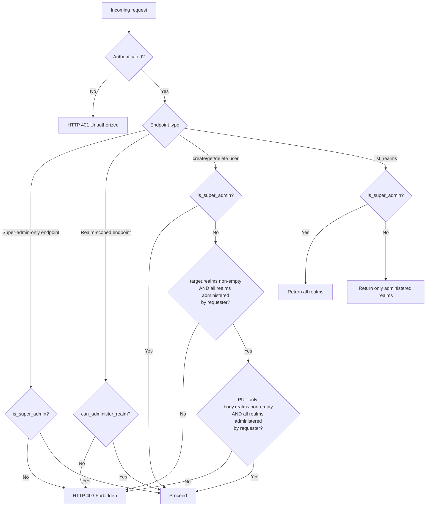

# Authorization Model

This document describes the two-tier authorization model for the authentication server.

> **Terminology:** A **client** is any entity that authenticates against `/login` (a human, a service, the CLI). A **`User` record** is an administrator account stored in the database — every `User` is either a super admin or a realm admin. See the [documentation index](documentation/index.md#terminology) for the full glossary.

---

## Concepts

### Super Admin

A **super admin** is a `User` record whose `realms` list contains the special sentinel value `"_"` (the `ADMIN_REALM` constant).

Super admins can perform **all** management operations: create, read, update, and delete realms and `User` records.

The initial super admin (seeded at first start) is the `User` record whose credentials are configured by `APP_REALM_ADMIN_USERNAME` / `APP_REALM_ADMIN_INITIAL_PASSWORD`.

```rust
pub fn is_super_admin(&self) -> bool {
    self.realms.contains(&ADMIN_REALM.to_string())  // ADMIN_REALM = "_"
}
```

### Realm Admin

A **realm admin** is a `User` record whose `realms` list contains one or more realm IDs (but not `"_"`). It may only administer the realms explicitly listed on the record.

The check is performed via:

```rust
pub fn can_administer_realm(&self, realm: &str) -> bool {
    self.realms.contains(&ADMIN_REALM.to_string())
        || self.realms.contains(&realm.to_string())
}
```

A super admin always satisfies `can_administer_realm` for any realm.

---

## Endpoint Authorization Matrix

### Realm Management (`/admin/*`)

| Method | Path | Who may call it |
|--------|------|-----------------|
| `POST` | `/admin/realm` | Super admin |
| `GET` | `/admin/realm/{id}` | Admin of `id` **or** super admin |
| `PUT` | `/admin/realm/{id}` | Super admin |
| `DELETE` | `/admin/realm/{id}` | Super admin |
| `GET` | `/admin/realms` | Any authenticated admin (filtered) |

> `GET /admin/realms` returns **all** realms for super admins and only the
> administered realms for realm admins.

### User Management (`/users/*`)

| Method | Path | Who may call it |
|--------|------|-----------------|
| `POST` | `/users/user` | Super admin **or** realm admin (see below) |
| `GET` | `/users/user/{id}` | Super admin **or** realm admin (see below) |
| `PUT` | `/users/user/{id}` | Super admin **or** realm admin (see below) |
| `DELETE` | `/users/user/{id}` | Super admin **or** realm admin (see below) |
| `GET` | `/users` | Super admin |
| `PUT` | `/users/user/{id}/realm/{realm_id}` | Admin of `realm_id` **or** super admin |
| `DELETE` | `/users/user/{id}/realm/{realm_id}` | Admin of `realm_id` **or** super admin |

#### Exclusive-Ownership Rule

For `POST /users/user`, `GET /users/user/{id}`, `PUT /users/user/{id}`, and `DELETE /users/user/{id}`, a realm admin is permitted **only when every realm in the target `User` record's `realms` list is administered by the requester** and the list is non-empty:

```rust
!target.realms.is_empty()
    && target.realms.iter().all(|r| requester.can_administer_realm(r))
```

In other words, a realm admin may create, read, or delete a `User` record that belongs **exclusively** to realm(s) they control. If the `User` record belongs to any realm the requester does not administer — including `"_"` — the request is rejected with HTTP 403.

For `PUT /users/user/{id}` specifically, the check is applied **twice**:

1. **Against the current DB state** of the user (same as GET/DELETE) — the requester must own the user as it currently exists.
2. **Against the incoming request body** — the new `realms` list submitted in the body must also be entirely within the requester's authority. This prevents a realm admin from silently escalating a user's privileges by injecting `"_"` or a foreign realm into the update body.

```rust
// Check 1: requester must own the current user.
!target.realms.is_empty()
    && target.realms.iter().all(|r| requester.can_administer_realm(r))

// Check 2: new realms in the body must also be within the requester's authority.
!user.realms.is_empty()
    && user.realms.iter().all(|r| requester.can_administer_realm(r))
```

The two realm-membership endpoints (`PUT` / `DELETE` on `.../realm/{realm_id}`) allow realm admins to grant or revoke access to **their own realm only**. They have no visibility into other realms.

### Credential Management (`/realms/*`)

These endpoints manage `UserPass` (username/password) credentials stored per realm.

| Method | Path | Who may call it |
|--------|------|-----------------|
| `POST` | `/realms/{realm}/userpass` | Admin of `realm` **or** super admin |
| `GET` | `/realms/{realm}/userpass/{username}` | Admin of `realm` **or** super admin |
| `PUT` | `/realms/{realm}/userpass/{username}` | Admin of `realm` **or** super admin |
| `DELETE` | `/realms/{realm}/userpass/{username}` | Admin of `realm` **or** super admin |
| `GET` | `/realms/{realm}/userpass` | Admin of `realm` **or** super admin |
| `GET` | `/admin/userpass` | Super admin only |

> **Cookie-realm constraint:** The `/realms/{R}/…` endpoints authenticate the caller using the cookie issued by `POST /login/{R}`. A session created by logging into realm `_` can only authenticate calls to `/realms/_/…`. A realm admin who logs into `_` can therefore only manage credentials in `_` — and only if `can_administer_realm("_")` is true (i.e., they are also a super admin).

---

## Authorization Decision Flow



---

## Authentication Mechanism

All management operations use the `UserAuth` middleware, which:

1. Reads the `_ea_` session cookie (set by `POST /login?realm={realm}`).
2. Resolves the session to a `ClientClaims` object (the authenticated client's identity).
3. Calls `database.find_users_by_auth_scheme(scheme, value)` to load the matching `User` record.
4. Injects the loaded `User` record into the Actix request extensions.

Endpoint handlers retrieve the `User` record with the `user_from_request(&req)` helper.

---

## Creating a Realm Admin

To configure a `User` record as a realm admin (e.g., for `my_realm`):

1. **Create credentials** in `ADMIN_REALM` so the user can log in:

   ```http
   POST /realms/_/userpass
   Content-Type: application/json

   {
     "realm": "_",
     "username": "alice",
     "password": "<hashed via Argon2id>",
     "change_password": false
   }
   ```

   > Use `UserPass::new("_", "alice", "plain_password", false)` in Rust to hash the password correctly.

2. **Create the `User` record** and link the realm memberships and credentials:

   ```http
   POST /users/user
   Content-Type: application/json

   {
     "id": "alice_user",
     "realms": ["my_realm"],
     "userpass": "alice"
   }
   ```

   The `userpass` field is the **username** (acting as a foreign key into the `userpass` table). It is **not** the password itself.

3. **Authenticate** via `POST /login/_` with `username=alice` and `password=<plain>`.  
   The resulting `_ea_` session cookie authorises any requests scoped to `my_realm`.

---

## Notes

- `User.realms` contains realm IDs the `User` record **administers**, not realms it is a *member of* in the business sense.
- Adding `"_"` to a `User` record's `realms` list promotes the associated client to super admin — handle with care. The `update_user` endpoint defends against this for realm admins by validating the body's `realms` list (check 2 of the exclusive-ownership rule above).
- Every `User` record in the system represents an administrator of some scope. There are no non-admin or read-only account types: a `User` record is either a **super admin** (administers all realms) or a **realm admin** (administers one or more specific realms).
- `delete_user` **cascade-deletes credentials**: when a `User` record is deleted, the associated `UserPass` credential rows (matched by `User.userpass` username) are also deleted automatically. There is no risk of credential orphaning.
- Passwords are hashed with **Argon2id** using a per-user salt derived from the username (SHA-256 → base64).
- Access control is two-tier (super admin vs. realm admin). Future extensions that require finer-grained roles should add explicit role fields rather than overloading `realms`.
- A cookie decryption failure (wrong realm key) returns **HTTP 401** — it is treated as an authentication failure, not a server error.
