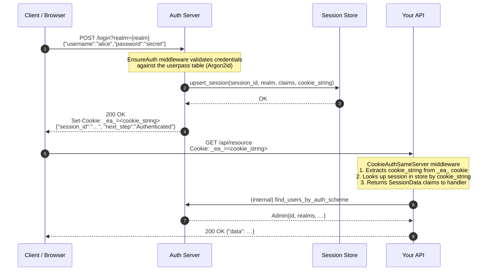
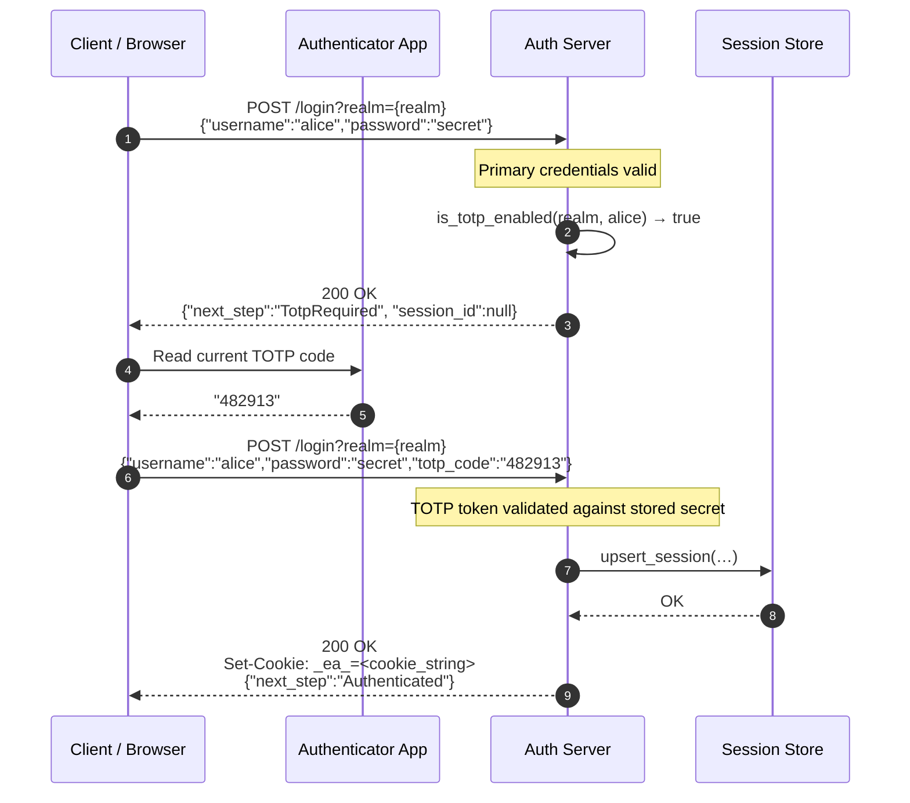
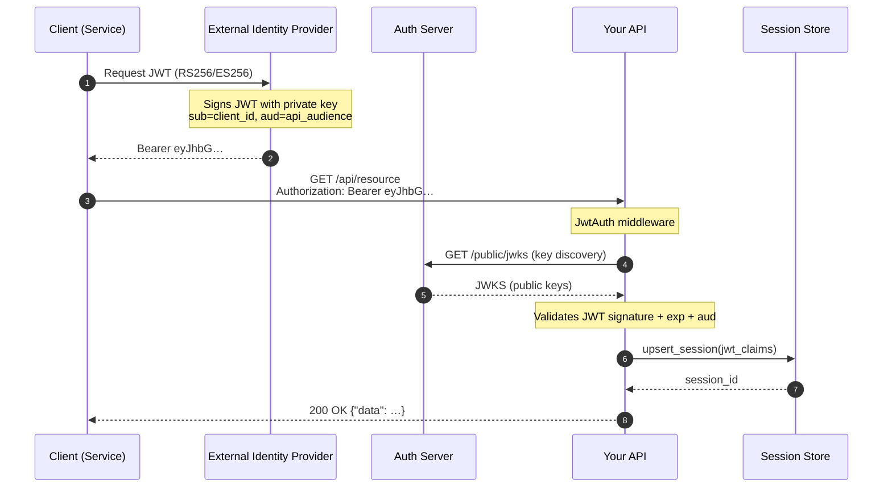
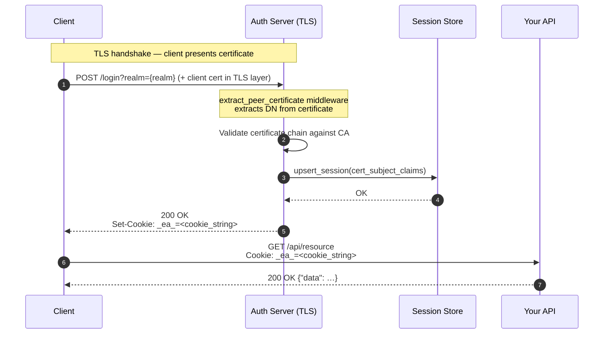
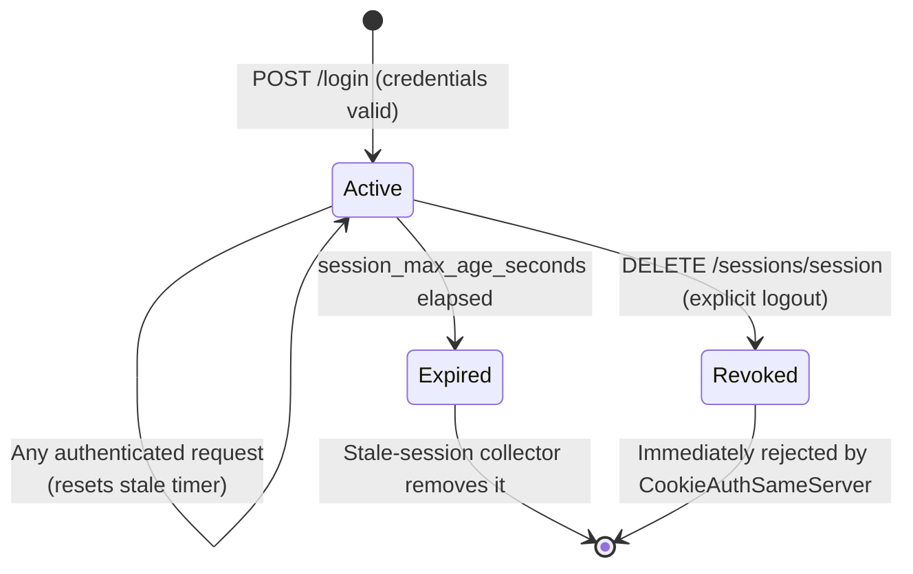
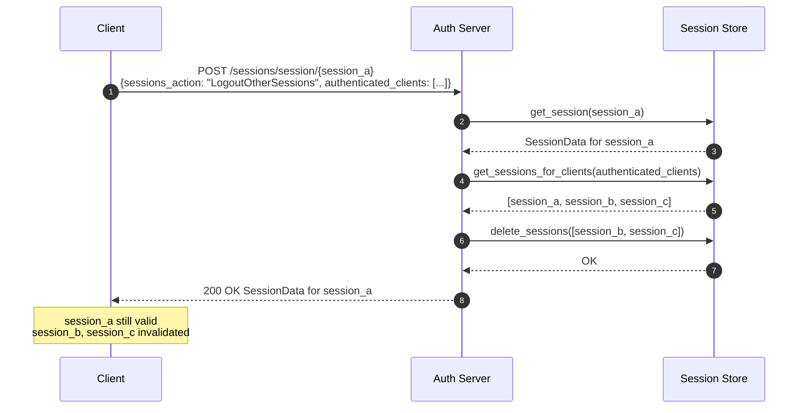
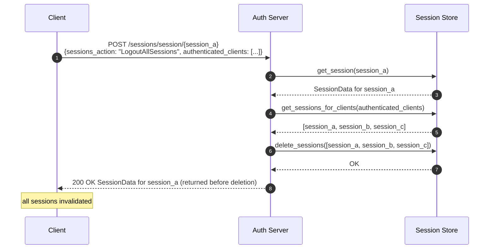
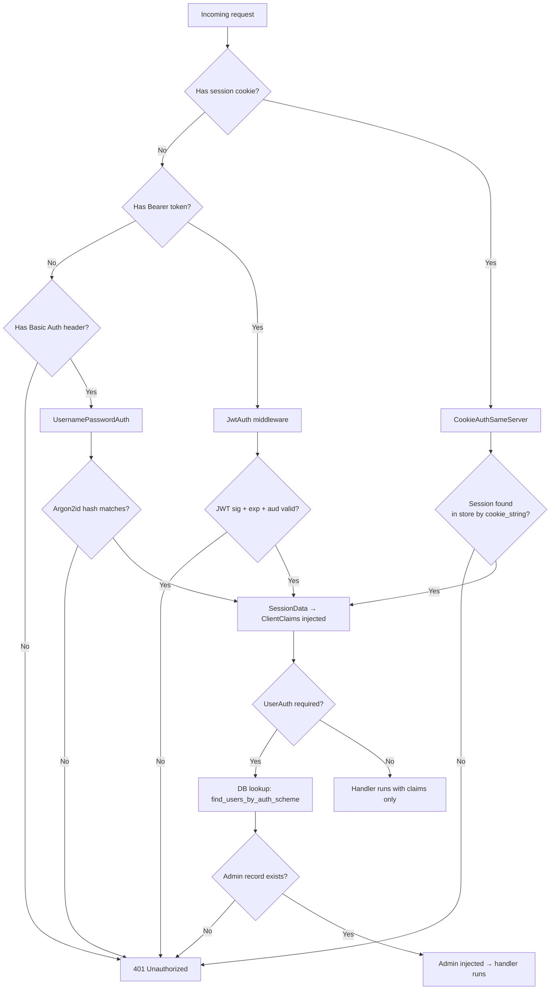

# Authentication Flows

This document describes the complete authentication flows supported by the Auth authentication server: cookie-based session authentication, JWT bearer authentication, and client-certificate authentication.

---

## Overview

The authentication server sits in front of your application. Every **client** must prove its identity to the auth server before it can access any protected resource. Once authenticated, the server issues a **session cookie** (`_ea_`) that the client presents on subsequent API requests.

```text
Client ──► Auth Server ──► Session Cookie ──► Your API ──► Services
```

> **Terminology note:** Throughout this documentation, **client** means any entity that authenticates against the `/login` endpoint — a human via browser, the Auth CLI, or a machine/service account. An **Admin** (capitalised) is a database record representing an administrator account (super admin or realm admin). See [index.md](index.md#terminology) for the full glossary.

All communication uses **HTTPS** (TLS). Session cookies carry a plain-text `cookie_string` that is the session identifier stored in the server-side session store.

---

## Realms

Every authentication operation is scoped to a **realm**. A realm is an isolated authentication domain with its own:

- Session lifetime settings
- Authentication parameters (which methods are allowed, TOTP requirements, etc.)

The special `_` realm (called `ADMIN_REALM`) is the administrative realm. All administrator clients authenticate through this realm.

---

## Flow 1 — Username / Password (Cookie Session)

This is the most common flow for clients (human or automated) such as web browsers or the Auth CLI.

### Happy-path sequence



### What the session cookie contains

The `_ea_` cookie value is a plain-text `cookie_string`. All session state is kept server-side in the session store. The `cookie_string` is used as a lookup key to retrieve the full `SessionData` record:

| Field | Type | Description |
|-------|------|-------------|
| `session_id` | `String` | Unique session identifier (UUID) |
| `realm_id` | `String` | Realm the session belongs to |
| `username` | `String` | Authenticated client username |
| `auth_scheme` | `String` | Authentication method used (`userpass`, `jwt`, `cert`) |
| `cookie_string` | `String` | The opaque value stored in the `_ea_` cookie |
| `max_age_seconds` | `i64` | Maximum absolute session lifetime |
| `max_stale_age_seconds` | `i64` | Maximum idle time before the session is considered stale |
| `created_at` | `i64` | Unix timestamp when the session was created |

### Credential validation

Passwords are hashed with **Argon2id** using a per-user salt:

```text
salt  = SHA-256(lowercase(username))  → base64url
hash  = Argon2id(password, salt, memory=19456, iterations=2, parallelism=1)
```

The hash is stored in the `userpass` table. On login, the server recomputes the hash and compares it in constant time.

---

## Flow 2 — Username / Password with 2FA (TOTP)

When a client's account has TOTP enabled, the login sequence requires a second step.

### Sequence with TOTP



> **Note:** The `next_step` field in the response tells the client what to do next:
>
> - `"Authenticated"` — login complete, cookie issued
> - `"TotpRequired"` — provide a TOTP code to proceed

See [two_factor_authentication.md](two_factor_authentication.md) for the full TOTP enrollment and management flows.

---

## Flow 3 — JWT Bearer Token

Machine-to-machine scenarios (service accounts, CI pipelines, SDKs) use RS256 or ES256 JWT tokens instead of cookies.

### Sequence



### Key discovery

The server exposes a JWKS endpoint at `GET /public/jwks` which returns the RSA/EC public keys used to verify tokens. The JWT middleware caches this document and refreshes it on a configurable interval.

### JWT requirements

| Claim | Required | Description |
|-------|----------|-------------|
| `sub` | Yes | Subject (user or service identifier) |
| `aud` | Yes | Must match the configured audience |
| `exp` | Yes | Expiration time (Unix seconds) |
| `iss` | Yes | Issuer URL matching JWKS discovery URL |

---

## Flow 4 — Client Certificate (mTLS)

For high-assurance scenarios, clients authenticate using an EC P-256 client certificate over mutual TLS.

### Sequence



---

## Session Lifecycle



### Session parameters (per realm)

| Parameter | Default | Description |
|-----------|---------|-------------|
| `session_max_age_seconds` | 3600 | Maximum absolute lifetime of a session |
| `session_max_stale_age_seconds` | 3600 | Maximum idle time before a session is considered stale |

Sessions are stored in the configured session backend (SQLite / PostgreSQL / MySQL / Redis).

### Explicit logout

To invalidate a session:

```http
DELETE /sessions/session
Content-Type: application/json

{"session_ids": ["<session_id>"]}
```

Administratively, a super admin can revoke all sessions for a realm:

```http
DELETE /sessions/session/realms/{realm_id}
```

---

## API Endpoint Reference

### Authentication endpoints

| Method | Path | Description | Auth required |
|--------|------|-------------|---------------|
| `POST` | `/login?realm={realm}` | Authenticate and issue a session cookie | No (credentials in body) |
| `GET` | `/whoami?realm={realm}` | Return the current session's claims | Session cookie |
| `GET` | `/public/version` | Server version string | No |
| `GET` | `/public/jwks` | JSON Web Key Set for JWT verification | No |

### Session management endpoints

| Method | Path | Description | Auth required |
|--------|------|-------------|---------------|
| `GET` | `/sessions/session/{id}` | Retrieve `SessionData` by session ID (`null` when not found) | — |
| `POST` | `/sessions/session/{id}` | Retrieve `SessionData` and optionally apply a `SessionsAction` | — |
| `POST` | `/sessions/session/realms/{realm}/admins` | Get `SessionData` list for a set of users | — |
| `DELETE` | `/sessions/session` | Delete sessions by ID list (logout) | — |
| `DELETE` | `/sessions/session/expired` | Purge all expired sessions | — |
| `DELETE` | `/sessions/session/realms/{realm}` | Revoke all sessions for a realm | — |

---

## Session Actions on `POST /sessions/session/{id}`

When fetching a session you can pass an optional `sessions_action` in the request body to perform a bulk logout as part of the same call. This is the recommended way to implement "log out everywhere else" and "log out everywhere" features.

### Request body

```json
{
  "authenticated_clients": [
    { "username": "alice", "auth_scheme": "UsernamePassword" }
  ],
  "sessions_action": "LogoutOtherSessions"
}
```

| Field | Type | Description |
|-------|------|-------------|
| `authenticated_clients` | `Vec<AuthenticatedClientScheme>` | Users whose sessions should be affected by the action |
| `sessions_action` | `SessionsAction` (optional) | Action to perform; omit for a plain session lookup |

### `SessionsAction` variants

| Variant | Behaviour |
|---------|-----------|
| `LogoutOtherSessions` | Deletes all active sessions for the given clients **except** the session being queried. Use this to implement "keep this session, log out everywhere else". |
| `LogoutAllSessions` | Deletes **all** active sessions for the given clients, including the queried session. The session data is returned before deletion. Use this to implement "log out everywhere". |

### Sequence — `LogoutOtherSessions`



### Sequence — `LogoutAllSessions`



---

## Request Authentication Decision Diagram

The following shows how the middleware stack decides whether to admit or reject an incoming request:



---
