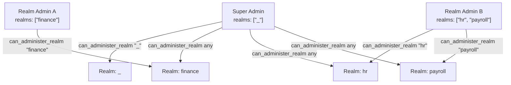
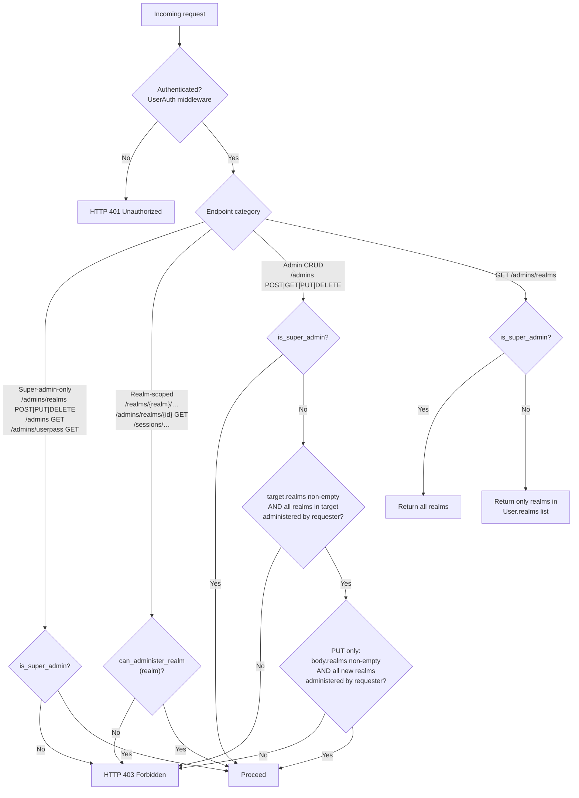
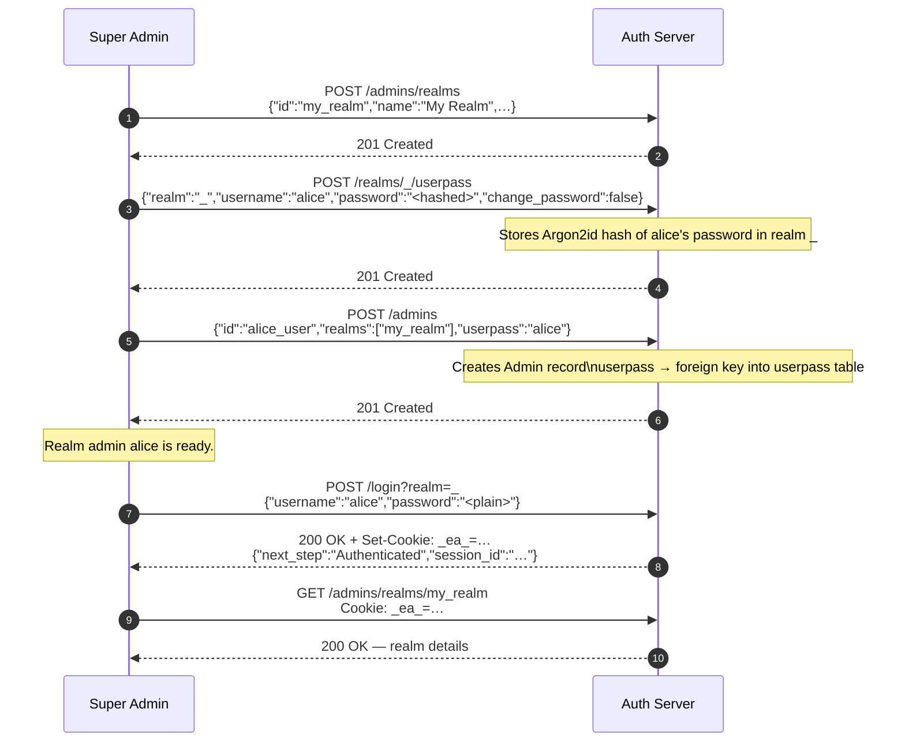

# Authorization and Administration

This document explains Auth's two-tier authorization model, how super admins and realm admins differ, how to bootstrap the first administrator, and how to delegate administration of individual realms.

---

## Overview

Every `Admin` record in the database represents an administrator — either a super admin or a realm admin. There are no purely client-facing account types: if a `Admin` record exists it has administrative authority over at least one realm. Clients authenticate against `/login` and receive a session cookie, but the associated `Admin` record determines what administrative operations they may perform.

The two tiers are:

| Tier            | Sentinel                                      | Condition                                                |
| --------------- | --------------------------------------------- | -------------------------------------------------------- |
| **Super Admin** | `Admin.realms` contains `"_"`                 | Can administer all realms and all users                  |
| **Realm Admin** | `Admin.realms` contains one or more realm IDs | Can administer only the listed realms (and their admins) |



---

## The `_` (Admin) Realm

The string `"_"` is the `ADMIN_REALM` constant. It is a real realm stored in the database and has two purposes:

1. **Authentication domain** — all administrator clients log in via `POST /login?realm=_`. The resulting `_ea_` session cookie is scoped to `_` and authorises all admin API calls.
2. **Super-admin sentinel** — a `Admin` record whose `realms` field contains `"_"` is recognised as a super admin.

---

## Authorization Helper Methods

The `Admin` struct provides two methods used by every endpoint handler:

```rust
/// Returns true if this Admin record represents a super admin.
pub fn is_super_admin(&self) -> bool {
    self.realms.contains(&ADMIN_REALM.to_string())  // "_"
}

/// Returns true if this Admin record may administer the given realm.
/// Super admins always satisfy this for every realm.
pub fn can_administer_realm(&self, realm: &str) -> bool {
    self.realms.contains(&ADMIN_REALM.to_string())
        || self.realms.contains(&realm.to_string())
}
```

---

## Authorization Decision Flow



---

## Endpoint Authorization Matrix

### Realm Management

| Method   | Endpoint              | Super Admin |           Realm Admin           |
| -------- | --------------------- | :---------: | :-----------------------------: |
| `POST`   | `/admins/realms`      |      ✅      |                ❌                |
| `GET`    | `/admins/realms/{id}` |      ✅      | ✅ if `can_administer_realm(id)` |
| `PUT`    | `/admins/realms/{id}` |      ✅      |                ❌                |
| `DELETE` | `/admins/realms/{id}` |      ✅      |                ❌                |
| `GET`    | `/admins/realms`      |    ✅ all    |           ✅ filtered            |

### Admin Management

| Method   | Endpoint                         | Super Admin |              Realm Admin              |
| -------- | -------------------------------- | :---------: | :-----------------------------------: |
| `POST`   | `/admins`                        |      ✅      |      ✅ if owns all target realms      |
| `GET`    | `/admins/{id}`                   |      ✅      |      ✅ if owns all target realms      |
| `PUT`    | `/admins/{id}`                   |      ✅      |   ✅ if owns current AND new realms    |
| `DELETE` | `/admins/{id}`                   |      ✅      |      ✅ if owns all target realms      |
| `GET`    | `/admins`                        |      ✅      |                   ❌                   |
| `PUT`    | `/admins/{id}/realms/{realm_id}` |      ✅      | ✅ if `can_administer_realm(realm_id)` |
| `DELETE` | `/admins/{id}/realms/{realm_id}` |      ✅      | ✅ if `can_administer_realm(realm_id)` |

### Credential Management

All `/realms/{realm}/userpass` endpoints require `can_administer_realm(realm)`.

| Method   | Endpoint                              | Super Admin |            Realm Admin             |
| -------- | ------------------------------------- | :---------: | :--------------------------------: |
| `POST`   | `/realms/{realm}/userpass`            |      ✅      | ✅ if `can_administer_realm(realm)` |
| `GET`    | `/realms/{realm}/userpass/{username}` |      ✅      | ✅ if `can_administer_realm(realm)` |
| `PUT`    | `/realms/{realm}/userpass/{username}` |      ✅      | ✅ if `can_administer_realm(realm)` |
| `DELETE` | `/realms/{realm}/userpass/{username}` |      ✅      | ✅ if `can_administer_realm(realm)` |
| `GET`    | `/realms/{realm}/userpass`            |      ✅      | ✅ if `can_administer_realm(realm)` |
| `GET`    | `/admins/userpass`                    |    ✅ all    |                 ❌                  |

### Session Management

| Method   | Endpoint                 | Super Admin |               Realm Admin                |
| -------- | ------------------------ | :---------: | :--------------------------------------: |
| `GET`    | `/sessions/{session_id}` |      ✅      | ✅ if session is in an administered realm |
| `DELETE` | `/sessions/{session_id}` |      ✅      | ✅ if session is in an administered realm |
| `GET`    | `/sessions`              |      ✅      |    ✅ filtered to administered realms     |

### Public / unauthenticated

| Method | Endpoint                 |       Anyone       |
| ------ | ------------------------ | :----------------: |
| `GET`  | `/public/version`        |         ✅          |
| `GET`  | `/.well-known/jwks.json` |         ✅          |
| `POST` | `/login`                 |         ✅          |
| `GET`  | `/whoami`                | ✅ (no `AdminAuth`) |

---

## The Exclusive-Ownership Rule

The most important protection for realm admins is the **exclusive-ownership rule**: a realm admin may only CRUD a `Admin` record if **every realm in that record's `realms` list** is administered by the requester.

```
allowed iff:
    !target.realms.is_empty()
    && target.realms.iter().all(|r| requester.can_administer_realm(r))
```

The intent is:

- A realm admin cannot view or modify `Admin` records that span multiple realms from different admins.
- A realm admin cannot delete a super admin (`Admin` records for super admins have `"_"` in their `realms` list, and realm admins cannot administer `"_"`).

### `PUT /admins/{id}` runs the rule **twice**:

```
Check 1 (current state): requester can own the user as it is now.
Check 2 (incoming body): requester can own the user as it would become.
```

This prevents privilege escalation: a realm admin cannot silently add `"_"` or a foreign realm to a user's `realms` list by providing it in the update body.

---

## Cookie-Realm Constraint

Session cookies are scoped to the realm through which the user logged in. A cookie issued by `POST /login?realm=_` can only authenticate requests that require the `_` realm's session.

The `/realms/{realm}/userpass` endpoints read the session cookie and check that the cookie's realm matches (or the caller is a super admin). Practically this means:

- A realm admin for `finance` who logs into `_` **cannot** manage `/realms/finance/userpass` entries — their cookie is for `_`, not for `finance`. They would need to authenticate as a client against the `finance` realm separately.
- A super admin who logs into `_` **can** manage `/realms/_/userpass` entries directly.

---

## Bootstrapping the First Super Admin

The first super admin is seeded at server startup from two environment variables:

| Variable                           | Description                                       |
| ---------------------------------- | ------------------------------------------------- |
| `APP_REALM_ADMIN_USERNAME`         | Username for the initial super admin              |
| `APP_REALM_ADMIN_INITIAL_PASSWORD` | Plaintext password (hashed with Argon2id at boot) |

At startup the server:

1. Creates the `_` realm if it does not exist.
2. Creates a `UserPass` entry for `APP_REALM_ADMIN_USERNAME` in realm `_`.
3. Creates a `Admin` record with `realms: ["_"]` and `userpass: APP_REALM_ADMIN_USERNAME`.

After bootstrapping, rotate or remove `APP_REALM_ADMIN_INITIAL_PASSWORD` from the environment.

---

## Creating a Realm Admin

Below is the step-by-step process for creating a realm admin for a realm named `my_realm`.



### What alice can now do

Alice's cookie (from `POST /login?realm=_`) authorises:

- `GET/POST/PUT/DELETE /realms/_/userpass/*` (credential management **in `_`**)
- `GET /admins/realms/my_realm`
- `POST /admins` with `realms: ["my_realm"]`
- CRUD on any user whose `realms` is a subset of `["my_realm"]`

Alice **cannot**:

- Create or delete realms
- Access `/admins` (list all users)
- Manage any other realm
- Manage users whose `realms` includes something other than `my_realm`

---

## Promoting an Admin to Super Admin

Only a super admin can promote another user to super admin. Assign `"_"` to the target user's `realms` list:

```http
PUT /admins/{alice_user_id}
Content-Type: application/json
Cookie: _ea_=<super_admin_cookie>

{
  "id": "alice_user",
  "realms": ["_"],
  "userpass": "alice"
}
```

> **Warning:** This grants full administrative access to every realm and every user. Only perform this operation when necessary, and audit the super admin list regularly.

---

## Credentials and the `userpass` Foreign Key

The `Admin.userpass` field is a **username** (not a password) that acts as a foreign key into the `userpass` table. There can be multiple `UserPass` rows with the same username if the same person authenticates in multiple realms.

When a `Admin` record is deleted, all associated `UserPass` credentials are **cascade-deleted** automatically (any orphaned credentials with the same username as `admin.userpass` are removed from all realms).

---

## Limitations and Known Caveats

### `GET /whoami` has no `AdminAuth`

`GET /whoami` returns the caller's identity from the session cookie but **does not use the `AdminAuth` middleware**. It cannot return a full `Admin` record — only the session claims (realm, username, and any custom claims) belonging to the authenticated **client** are available. It is not subject to realm-admin authorization checks.

### No non-admin client accounts

There is no built-in concept of a client whose presence in the database does not confer administrative rights. Any `Admin` record that exists with at least one realm in its `realms` list is a realm admin for that realm. Applications that need non-admin client accounts should model that distinction at the application level, outside the authentication server.

### Concurrent realm admin creation

Creating two realm admin users simultaneously for the same username is not prevented at the application level. The database unique constraint on `userpass(username)` is the only safeguard. Ensure the caller serializes user creation at the client side.
