# Authentication Flows

This document describes every authentication flow supported by the Authentication Verifier:

| # | Flow | Credential | Output |
|---|------|------------|--------|
| 1 | [Username / Password](#flow-1--username--password-cookie-session) | HTTP Basic / JSON body | `_ea_` session cookie |
| 2 | [Username / Password + TOTP](#flow-2--username--password-with-2fa-totp) | Credentials + TOTP code | `_ea_` session cookie |
| 3 | [JWT Bearer](#flow-3--jwt-bearer-token) | Signed JWT | `_ea_` session cookie |
| 4 | [Client Certificate (mTLS)](#flow-4--client-certificate-mtls) | TLS client certificate | `_ea_` session cookie |
| 5 | [AppRole](#flow-5--approle-machine-credentials) | `role_id` + `secret_id` | `X-Vault-Token` app token |
| 6 | [Kubernetes service-account](#flow-6--kubernetes-service-account) | Kubernetes SA JWT | `X-Vault-Token` app token |
| 7 | [Token self-service](#flow-7--token-self-service) | Existing app token | Metadata / renewed token |

Flows 1–4 produce a **session cookie** (`_ea_`) used by human and administrator clients. Flows 5–6 produce an opaque **app token** (`X-Vault-Token`) for machine-to-machine workloads. Flow 7 is the self-service lifecycle for app tokens produced by flows 5 and 6.

---

## Overview

The Authentication Verifier sits in front of your application. Every **client** must prove its identity to the Authentication Verifier before it can access any protected resource. Once authenticated, the server issues a **session cookie** (`_ea_`) that the client presents on subsequent API requests.

```text
Client ──► Authentication Verifier ──► Session Cookie ──► Your API ──► Services
```

> **Terminology note:** Throughout this documentation, **client** means any entity that authenticates against the `/login` endpoint — a human via browser, the Auth CLI, or a machine/service account. An **Admin** (capitalised) is a database record representing an administrator account (super admin or realm admin). See [index.md](index.md#terminology) for the full glossary.

All communication uses **HTTPS** (TLS). Session cookies carry a plain-text `cookie_string` that is the session identifier stored in the server-side session store.

---

## Realms

Every authentication operation is scoped to a **realm**. A realm is an isolated authentication domain with its own:

- Session lifetime settings
- Authentication parameters (which methods are allowed, TOTP requirements, etc.)

The special `_` realm (called `ADMIN_REALM`) is the administrative realm. All administrator clients authenticate through this realm.

---

## Flow 1 — Username / Password (Cookie Session)

This is the most common flow for clients (human or automated) such as web browsers or the Auth CLI.

### Happy-path sequence

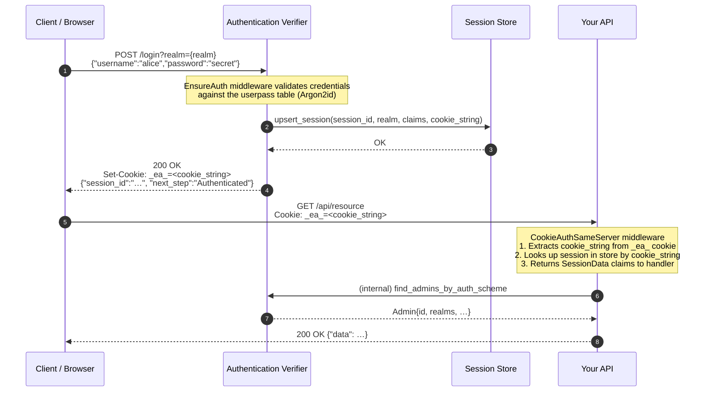

### What the session cookie contains

The `_ea_` cookie value is a plain-text `cookie_string`. All session state is kept server-side in the session store. The `cookie_string` is used as a lookup key to retrieve the full `SessionData` record:

| Field                   | Type     | Description                                              |
| ----------------------- | -------- | -------------------------------------------------------- |
| `session_id`            | `String` | Unique session identifier (UUID)                         |
| `realm_id`              | `String` | Realm the session belongs to                             |
| `username`              | `String` | Authenticated client username                            |
| `auth_scheme`           | `String` | Authentication method used (`userpass`, `jwt`, `cert`)   |
| `cookie_string`         | `String` | The opaque value stored in the `_ea_` cookie             |
| `max_age_seconds`       | `i64`    | Maximum absolute session lifetime                        |
| `max_stale_age_seconds` | `i64`    | Maximum idle time before the session is considered stale |
| `created_at`            | `i64`    | Unix timestamp when the session was created              |

### Credential validation

Passwords are hashed with **Argon2id** using a per-user salt:

```text
salt  = SHA-256(lowercase(username))  → base64url
hash  = Argon2id(password, salt, memory=19456, iterations=2, parallelism=1)
```

The hash is stored in the `userpass` table. On login, the server recomputes the hash and compares it in constant time.

---

## Flow 2 — Username / Password with 2FA (TOTP)

When a client's account has TOTP enabled, the login sequence requires a second step.

### Sequence with TOTP

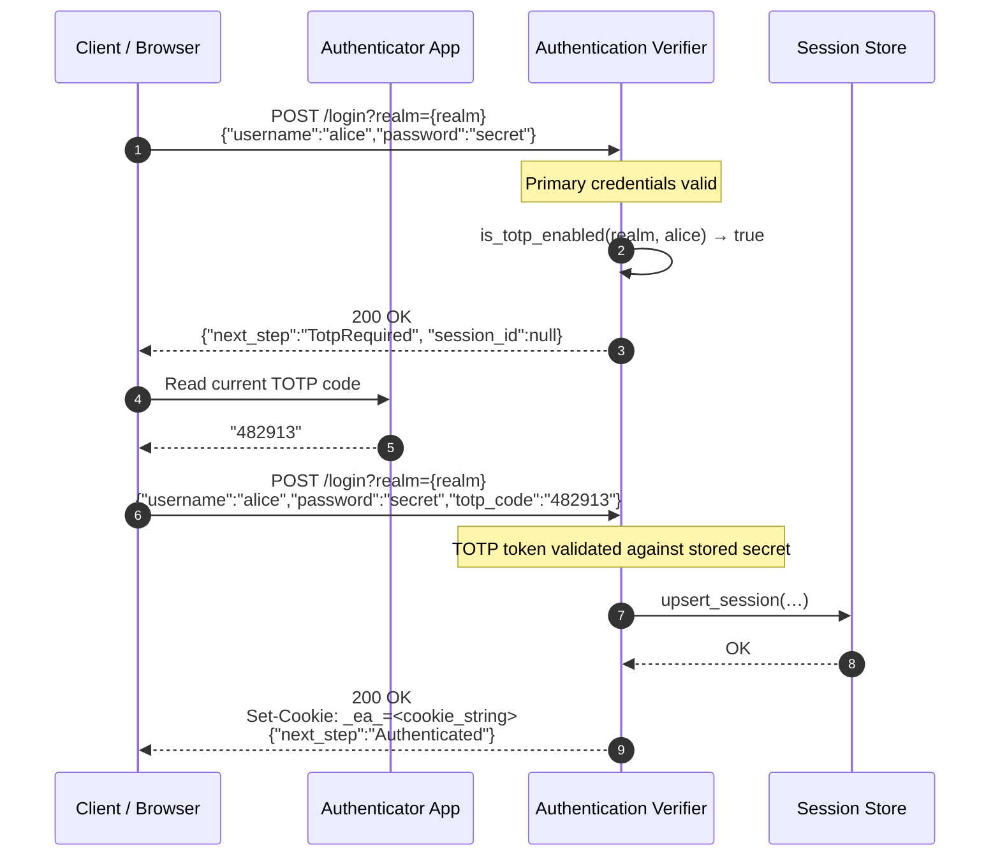

> **Note:** The `next_step` field in the response tells the client what to do next:
>
> - `"Authenticated"` — login complete, cookie issued
> - `"TotpRequired"` — provide a TOTP code to proceed

See [two_factor_authentication.md](two_factor_authentication.md) for the full TOTP enrollment and management flows.

---

## Flow 3 — JWT Bearer Token

Machine-to-machine scenarios (service accounts, CI pipelines, SDKs) use RS256 or ES256 JWT tokens instead of cookies.

### JWT Bearer Token sequence

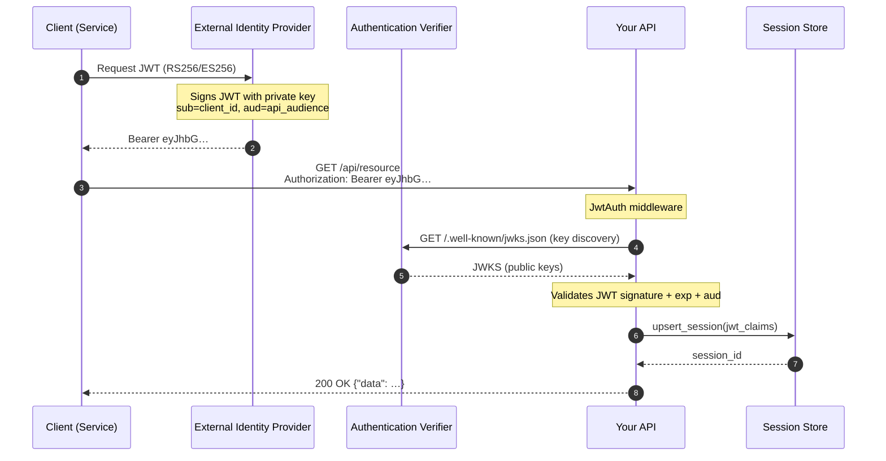

### Key discovery

The server exposes a JWKS endpoint at `GET /.well-known/jwks.json` which returns the RSA/EC public keys used to verify tokens. The JWT middleware caches this document and refreshes it on a configurable interval.

### JWT requirements

| Claim | Required | Description                            |
| ----- | -------- | -------------------------------------- |
| `sub` | Yes      | Subject (user or service identifier)   |
| `aud` | Yes      | Must match the configured audience     |
| `exp` | Yes      | Expiration time (Unix seconds)         |
| `iss` | Yes      | Issuer URL matching JWKS discovery URL |

---

## Flow 4 — Client Certificate (mTLS)

For high-assurance scenarios, clients authenticate using an EC P-256 client certificate over mutual TLS.

### Client Certificate sequence

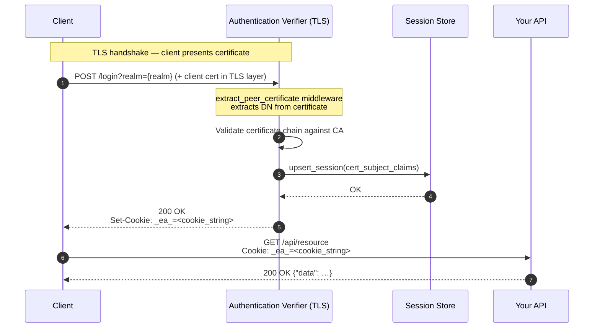

---

## Flow 5 — AppRole (Machine Credentials)

AppRole is the recommended flow for **server-to-server** and **SPIRE** workloads. An operator provisions a role out-of-band; the service uses its `role_id` + `secret_id` pair to obtain an opaque app token (`X-Vault-Token`).

### AppRole sequence

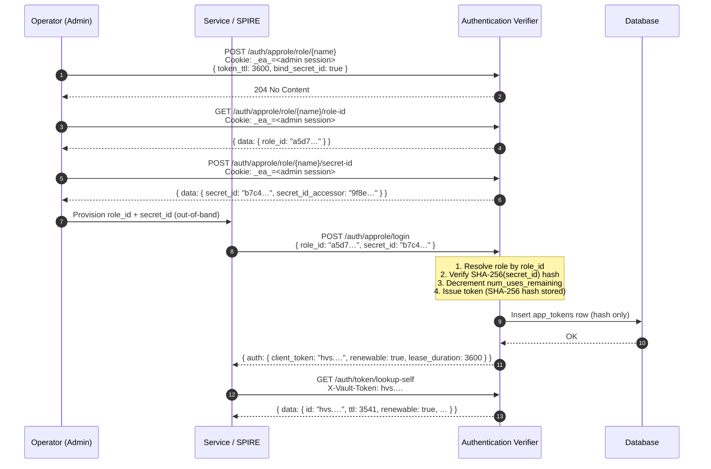

!!! warning "Secret ID consumption"
    Each successful login consumes one use of the `secret_id`. With `num_uses = 1` (the SPIRE default), the secret ID is permanently invalidated after the first login. Generate a new one before the service restarts.

For the full endpoint reference, field descriptions, and management operations, see [app_auth_api.md](app_auth_api.md#approle-auth-method).

---

## Flow 6 — Kubernetes Service-Account

Kubernetes workloads authenticate by presenting their pod-mounted **service-account JWT**. No operator-provisioned secret is required — the JWT is the credential.

### Kubernetes sequence

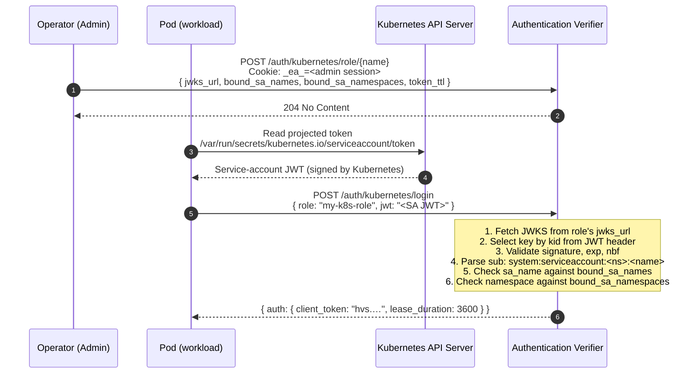

!!! warning "JWKS availability"
    A JWKS endpoint outage blocks new Kubernetes logins for the duration of the outage. Existing tokens remain valid until their TTL expires.

For the full endpoint reference and field descriptions, see [app_auth_api.md](app_auth_api.md#kubernetes-auth-method).

---

## Flow 7 — Token Self-Service

All app tokens — regardless of which method produced them (AppRole or Kubernetes) — expose three self-service endpoints. These require a valid `X-Vault-Token` header.

### Token self-service sequence

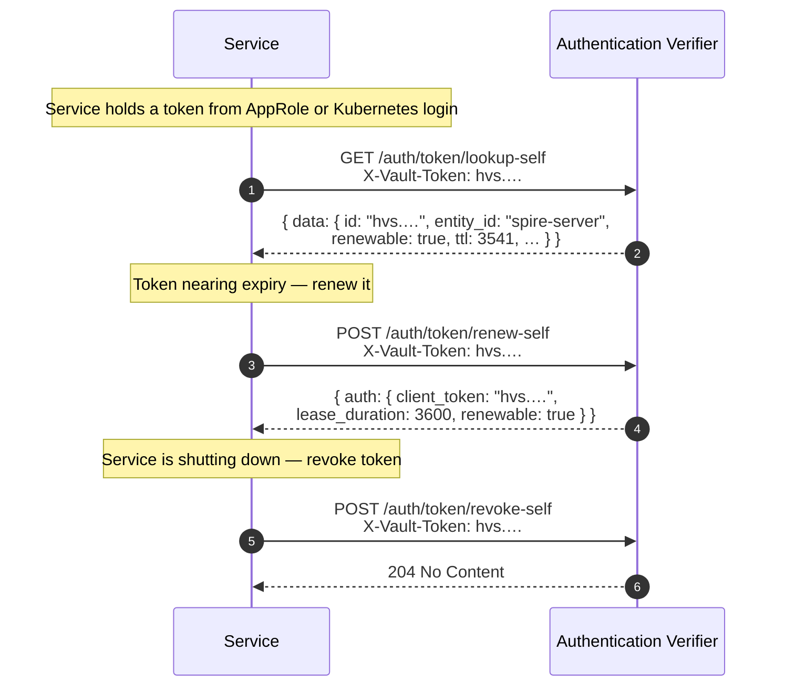

### App token lifecycle

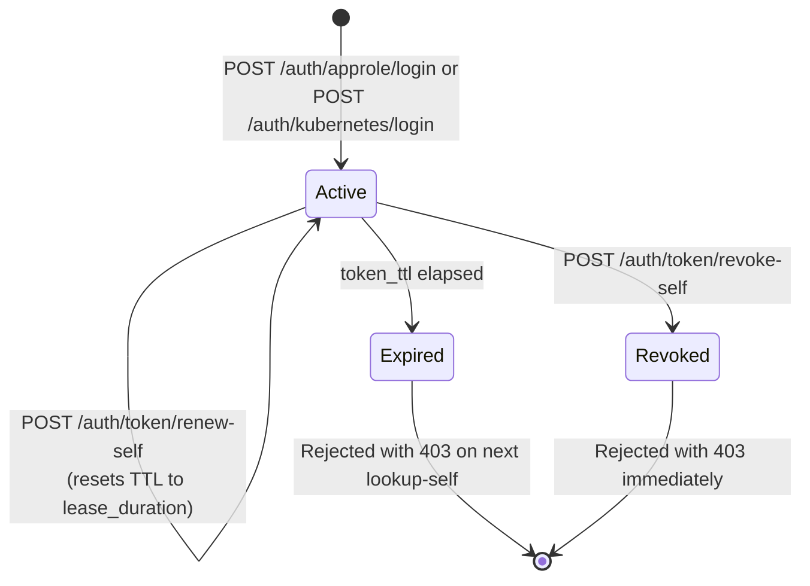

For the full endpoint reference, see [app_auth_api.md](app_auth_api.md#token-self-service).

---

## Session Lifecycle

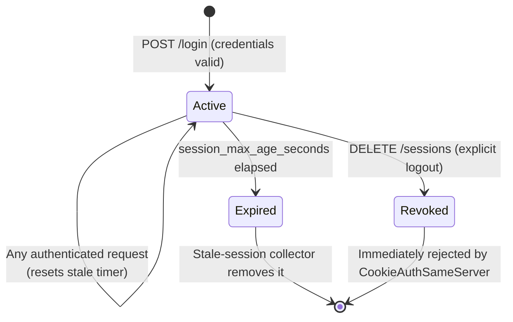

### Session parameters (per realm)

| Parameter                       | Default | Description                                            |
| ------------------------------- | ------- | ------------------------------------------------------ |
| `session_max_age_seconds`       | 3600    | Maximum absolute lifetime of a session                 |
| `session_max_stale_age_seconds` | 3600    | Maximum idle time before a session is considered stale |

Sessions are stored in the configured session backend (SQLite / PostgreSQL / MySQL / Redis).

### Explicit logout

To invalidate a session:

```http
DELETE /sessions
Content-Type: application/json

{"session_ids": ["<session_id>"]}
```

Administratively, a super admin can revoke all sessions for a realm:

```http
DELETE /sessions/realms/{realm_id}
```

---

## API Endpoint Reference

### Human / session authentication endpoints

| Method | Path                     | Description                                         | Auth required            |
| ------ | ------------------------ | --------------------------------------------------- | ------------------------ |
| `POST` | `/login?realm={realm}`   | Authenticate and issue a session cookie             | No (credentials in body) |
| `GET`  | `/whoami?realm={realm}`  | Return the current session's claims as a signed JWT | Session cookie           |
| `GET`  | `/public/version`        | Server version string                               | No                       |
| `GET`  | `/.well-known/jwks.json` | JSON Web Key Set for JWT verification               | No                       |

### Machine authentication endpoints

These endpoints produce or manage **app tokens** (`X-Vault-Token`). See [app_auth_api.md](app_auth_api.md) for full request/response detail.

#### AppRole — login

| Method       | Path                  | Description                            | Auth required     |
| ------------ | --------------------- | -------------------------------------- | ----------------- |
| `POST`/`PUT` | `/auth/approle/login` | Exchange `role_id` + `secret_id` for an app token | No (credential is body) |

#### AppRole — role management (requires admin session cookie)

| Method   | Path                                         | Description                          |
| -------- | -------------------------------------------- | ------------------------------------ |
| `POST`   | `/auth/approle/role/{name}`                  | Create or update a role              |
| `GET`    | `/auth/approle/role/{name}/role-id`          | Read the stable `role_id`            |
| `POST`   | `/auth/approle/role/{name}/secret-id`        | Generate a new `secret_id`           |
| `POST`   | `/auth/approle/role/{name}/secret-id/destroy`| Invalidate a `secret_id` by accessor |
| `DELETE` | `/auth/approle/role/{name}`                  | Delete a role                        |
| `GET`    | `/auth/approle/role?list=true`               | List all role names                  |

#### Kubernetes — login

| Method | Path                      | Description                                      | Auth required     |
| ------ | ------------------------- | ------------------------------------------------ | ----------------- |
| `POST` | `/auth/kubernetes/login`  | Exchange a K8s service-account JWT for an app token | No (credential is body) |

#### Kubernetes — role management (requires admin session cookie)

| Method   | Path                              | Description                        |
| -------- | --------------------------------- | ---------------------------------- |
| `POST`   | `/auth/kubernetes/role/{name}`    | Create or update a Kubernetes role |
| `DELETE` | `/auth/kubernetes/role/{name}`    | Delete a Kubernetes role           |

#### Token self-service (requires `X-Vault-Token` header)

| Method | Path                          | Description                                  |
| ------ | ----------------------------- | -------------------------------------------- |
| `GET`  | `/auth/token/lookup-self`     | Validate token and return its metadata       |
| `POST` | `/auth/token/renew-self`      | Extend a renewable token's TTL               |
| `POST` | `/auth/token/revoke-self`     | Immediately invalidate the current token     |

### Session JWT — `/whoami` response

`GET /whoami?realm={realm}` returns a signed JWT (`ClientClaims`) whose payload is a
**flat JSON object** containing three groups of claims:

| Claim    | Group                             | Description                                              |
| -------- | --------------------------------- | -------------------------------------------------------- |
| `sub`    | Registered (RFC 7519 §4.1.2)      | Username of the authenticated client                     |
| `exp`    | Registered                        | Expiry time (Unix seconds)                               |
| `iat`    | Registered                        | Issued-at time (Unix seconds)                            |
| `roles`  | Authorization (RFC 9068 §2.2.3.1) | RBAC roles assigned to the user — **omitted when empty** |
| `as_as`  | Private                           | Auth scheme: `"up"` / `"jwt"` / `"cc"` / `"f2"` / `"dc"` |
| `as_rid` | Private                           | Realm ID (also used as the OPA domain scope)             |
| `as_pk`  | Private                           | Client public key PEM — only present for mTLS sessions   |

The `roles` claim follows [RFC 9068 §2.2.3.1](https://www.rfc-editor.org/rfc/rfc9068#section-2.2.3.1)
and [RFC 7643 §4.1.2](https://www.rfc-editor.org/rfc/rfc7643#section-4.1.2). It is
a flat `Vec<String>` of role names (e.g. `["CryptoOfficer"]`). Absence means no
roles — downstream OPA policies should treat absence as fail-closed.

Roles are set per credential via the admin API. See the
[Credential Management](client_library.md#credential-management) section of the
client library guide for the `UserPass.roles` field, and the
[`ClientClaims` type reference](client_library.md#clientclaims) for the full
struct layout and a wire-format example.

### Session management endpoints

| Method   | Path                               | Description                                                    | Auth required |
| -------- | ---------------------------------- | -------------------------------------------------------------- | ------------- |
| `GET`    | `/sessions/{id}`                   | Retrieve `SessionData` by session ID (`null` when not found)   | —             |
| `POST`   | `/sessions/{id}`                   | Retrieve `SessionData` and optionally apply a `SessionsAction` | —             |
| `POST`   | `/sessions/realms/{realm}/clients` | Get session IDs for a set of clients                           | —             |
| `DELETE` | `/sessions`                        | Delete sessions by ID list (logout)                            | —             |
| `DELETE` | `/sessions/expired`                | Purge all expired sessions                                     | —             |
| `DELETE` | `/sessions/realms/{realm}`         | Revoke all sessions for a realm                                | —             |

---

## Session Actions on `POST /sessions/{id}`

When fetching a session you can pass an optional `sessions_action` in the request body to perform a bulk logout as part of the same call. This is the recommended way to implement "log out everywhere else" and "log out everywhere" features.
<!-- TODO : Where is the recommendation from ? -->

### Request body

```json
{
  "authenticated_clients": [
    { "username": "alice", "auth_scheme": "UsernamePassword" }
  ],
  "sessions_action": "LogoutOtherSessions"
}
```

| Field                   | Type                             | Description                                           |
| ----------------------- | -------------------------------- | ----------------------------------------------------- |
| `authenticated_clients` | `Vec<AuthenticatedClientScheme>` | Users whose sessions should be affected by the action |
| `sessions_action`       | `SessionsAction` (optional)      | Action to perform; omit for a plain session lookup    |

### `SessionsAction` variants

| Variant               | Behaviour                                                                                                                                                                       |
| --------------------- | ------------------------------------------------------------------------------------------------------------------------------------------------------------------------------- |
| `LogoutOtherSessions` | Deletes all active sessions for the given clients **except** the session being queried. Use this to implement "keep this session, log out everywhere else".                     |
| `LogoutAllSessions`   | Deletes **all** active sessions for the given clients, including the queried session. The session data is returned before deletion. Use this to implement "log out everywhere". |

### Sequence — `LogoutOtherSessions`

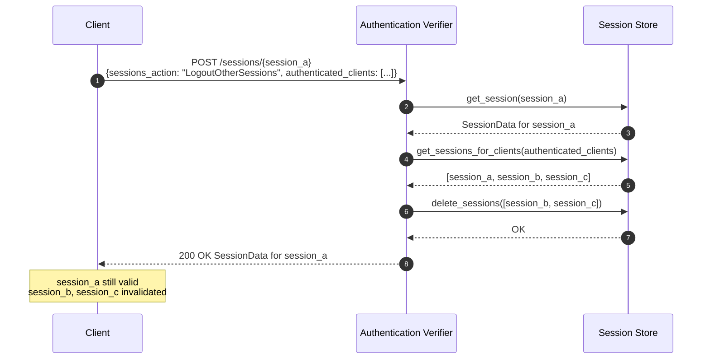

### Sequence — `LogoutAllSessions`

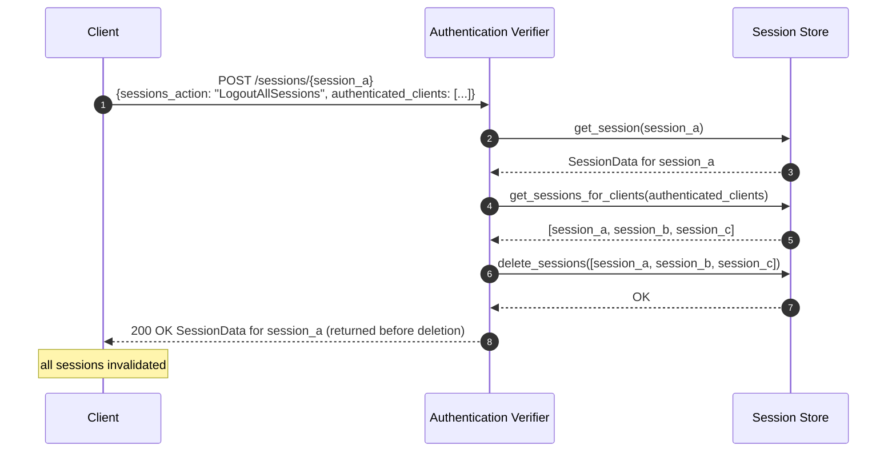

---

## Request Authentication Decision Diagram

The following shows how the middleware stack decides whether to admit or reject an incoming request:

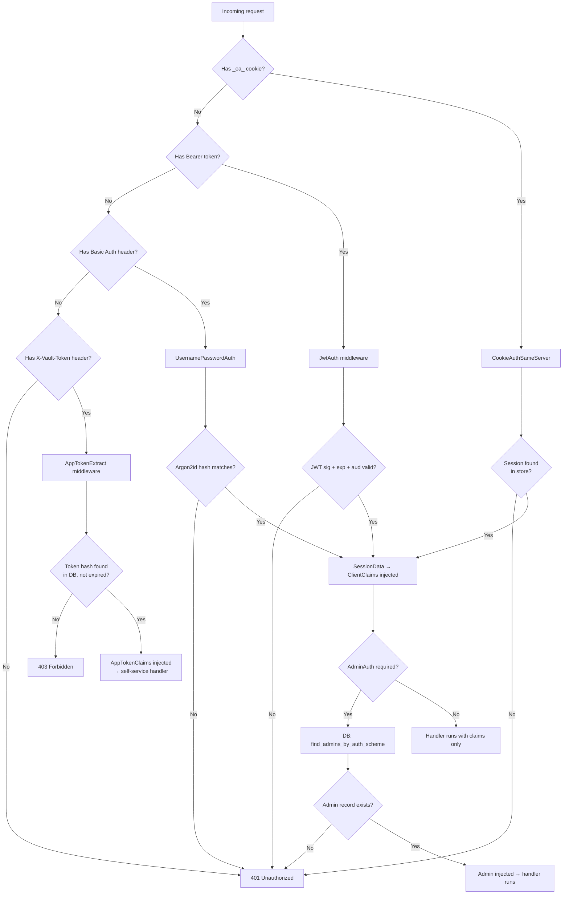

> **Note:** AppRole login (`POST /auth/approle/login`) and Kubernetes login (`POST /auth/kubernetes/login`) are unauthenticated — the credential is the request body. They are not represented above.

---
