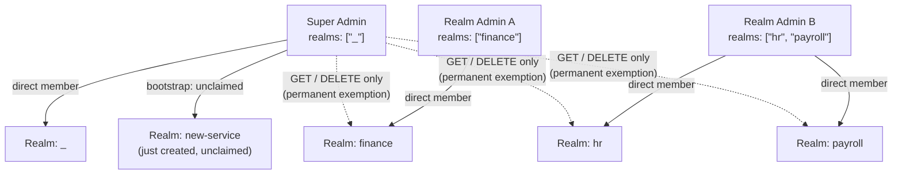
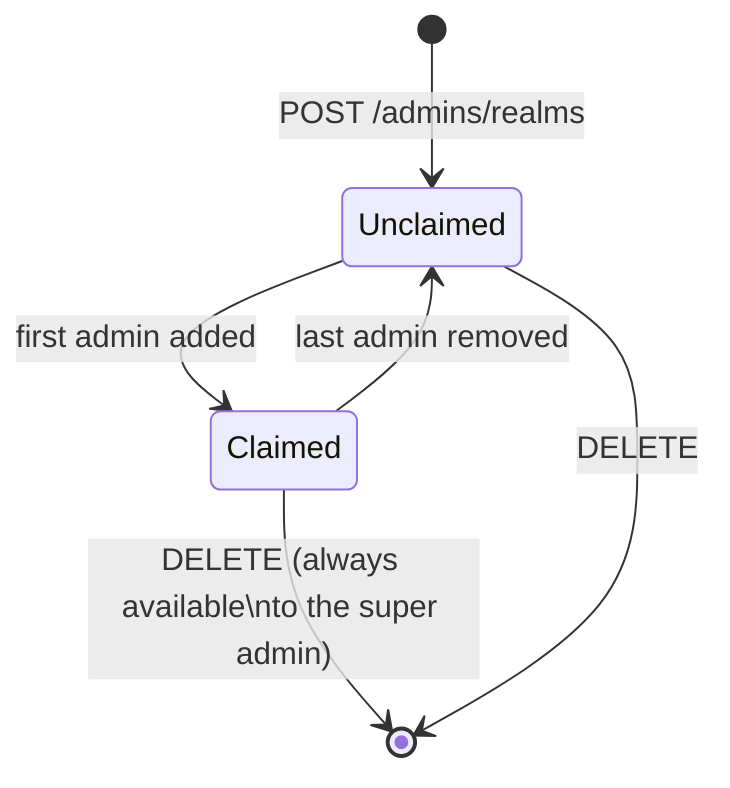
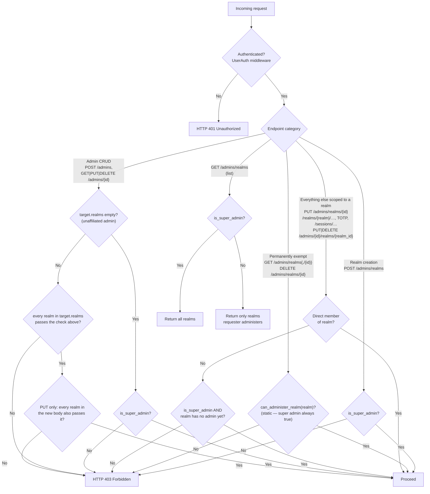
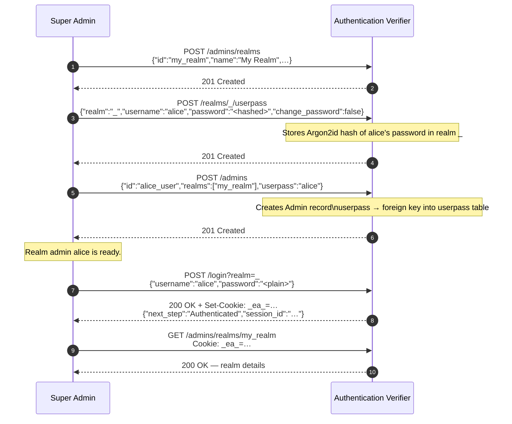

# Authorization and Administration

This document explains Auth's two-tier authorization model, how super admins and realm admins differ, how to bootstrap the first administrator, and how to delegate administration of individual realms.

---

## Overview

Every `Admin` record in the database represents an administrator — either a super admin or a realm admin. There are no purely client-facing account types: if a `Admin` record exists it has administrative authority over at least one realm. Clients authenticate against `/login` and receive a session cookie, but the associated `Admin` record determines what administrative operations they may perform.

The two tiers are:

| Tier            | Sentinel                                      | Condition                                                                        |
| --------------- | --------------------------------------------- | --------------------------------------------------------------------------------- |
| **Super Admin** | `Admin.realms` contains `"_"`                 | Can administer any realm **that has no admin of its own yet** (plus always retains `GET`/`DELETE` on any realm — see below) |
| **Realm Admin** | `Admin.realms` contains one or more realm IDs | Can administer only the listed realms (and their admins)                        |



Once `new-service` gets its first admin, it moves from the super admin's solid-line bootstrap access to the same dashed, `GET`/`DELETE`-only relationship shown for `finance`, `hr`, and `payroll` — see [Realm-Claim Lifecycle](#realm-claim-lifecycle).

---

## The `_` (Admin) Realm

The string `"_"` is the `ADMIN_REALM` constant. It is a real realm stored in the database and has two purposes:

1. **Authentication domain** — all administrator clients log in via `POST /login?realm=_`. The resulting `_ea_` session cookie is scoped to `_` and authorises all admin API calls.
2. **Super-admin sentinel** — a `Admin` record whose `realms` field contains `"_"` is recognised as a super admin.

---

## Realm-Claim Lifecycle

A realm is **unclaimed** from the moment it is created until it gets its first admin, and **claimed** from that point on. This is not a stored flag — it is recomputed on every request by checking whether any `Admin` record's `realms` list already contains the realm.

| State         | Who may manage its admins, credentials, and config (`PUT` on the realm) |
| ------------- | ------------------------------------------------------------------------ |
| **Unclaimed** | The super admin (bootstrap access) — this is how the very first admin of a new realm gets created |
| **Claimed**   | Only that realm's own admin(s). The super admin loses access, **including read access**, to its admins and credentials |

Two operations are exempt from this rule and stay available to the super admin **permanently**, regardless of claim status:

- `GET /admins/realms/{id}` and `GET /admins/realms` — visibility is never revoked, so an operator can always see that a realm exists.
- `DELETE /admins/realms/{id}` — a safety net so an abandoned realm (its admins gone, or nobody ever cleaning it up) can always be removed, even though the super admin can no longer configure or administer it day to day.

The claim is re-evaluated on every request rather than recorded once: if a realm's last admin is removed, the realm reverts to unclaimed and the super admin regains bootstrap access automatically — no manual reset needed.



---

## Authorization Helper Methods

The `Admin` struct provides two static, database-less methods:

```rust
/// Returns true if this Admin record represents a super admin.
pub fn is_super_admin(&self) -> bool {
    self.realms.contains(&ADMIN_REALM.to_string())  // "_"
}

/// Returns true if this Admin record directly belongs to the given realm
/// (or is a super admin). A static check only — see below.
pub fn can_administer_realm(&self, realm: &str) -> bool {
    self.realms.contains(&ADMIN_REALM.to_string())
        || self.realms.contains(&realm.to_string())
}
```

`can_administer_realm` alone only answers "does this admin directly belong to this realm?" — it has no way to know whether the realm has since been claimed by someone else, so it is **not sufficient on its own** for most endpoints. It remains exactly right for the two permanently-exempt operations above (`GET`/`DELETE` on a single realm), and it stays in the public client SDK as a lightweight, database-less hint (e.g. "should the UI show this button?").

Everywhere else, the server pairs it with two async, database-backed helpers that implement the realm-claim rule:

```rust
/// Whether `requester` may administer `realm_id` right now. Direct
/// membership always grants access; a super admin who is not a direct
/// member gets access only while the realm has no admin of its own yet.
pub async fn can_manage_realm(requester: &Admin, realm_id: &str, database: &Data<Arc<dyn Database>>) -> Result<bool, AuthError>;

/// Same, but for every realm an `Admin` record (or a create/update request
/// body) lists — the claim-aware form of the exclusive-ownership rule below.
pub async fn can_manage_admin_realms(requester: &Admin, realms: &[String], database: &Data<Arc<dyn Database>>) -> Result<bool, AuthError>;
```

---

## Authorization Decision Flow



`GET /admins` and `GET /admins/userpass` follow the same "Admin CRUD" / "target.realms" branch as above, applied per item, to decide what the returned list includes.

---

## Endpoint Authorization Matrix

### Realm Management

| Method   | Endpoint              |     Super Admin      |            Realm Admin            |
| -------- | --------------------- | :-------------------: | :--------------------------------: |
| `POST`   | `/admins/realms`      |          ✅            |                 ❌                  |
| `GET`    | `/admins/realms/{id}` |      ✅ always ¹       |  ✅ if `can_administer_realm(id)`  |
| `PUT`    | `/admins/realms/{id}` |    ✅ if unclaimed     | ✅ if administers realm (once claimed) |
| `DELETE` | `/admins/realms/{id}` |      ✅ always ¹       |       ✅ if administers realm       |
| `GET`    | `/admins/realms`      |        ✅ all ¹        |            ✅ filtered             |

¹ `GET` and `DELETE` on a single realm, and `GET` on the list, are the operations permanently exempt from the realm-claim rule — see [Realm-Claim Lifecycle](#realm-claim-lifecycle). They still use the static `can_administer_realm`, not the claim-aware checks below.

### Admin Management

| Method   | Endpoint                         |       Super Admin        |        Realm Admin        |
| -------- | --------------------------------- | :-----------------------: | :-------------------------: |
| `POST`   | `/admins`                        |          ✅ ²              |            ✅ ²              |
| `GET`    | `/admins/{id}`                   |          ✅ ²              |            ✅ ²              |
| `PUT`    | `/admins/{id}`                   |    ✅ ² (current AND new)  |     ✅ ² (current AND new)   |
| `DELETE` | `/admins/{id}`                   |          ✅ ²              |            ✅ ²              |
| `GET`    | `/admins`                        |     ✅ (results filtered)  |             ❌               |
| `PUT`    | `/admins/{id}/realms/{realm_id}` |     ✅ if realm unclaimed  |  ✅ if administers realm_id, and owns target ³ |
| `DELETE` | `/admins/{id}/realms/{realm_id}` |     ✅ if realm unclaimed  |  ✅ if administers realm_id, and owns target ³ |

² Subject to the claim-aware **exclusive-ownership rule** — see below. Super admins and realm admins are now treated symmetrically here: a super admin qualifies for a non-empty realm list only while every realm in it is unclaimed, exactly like a realm admin needs to already administer it.
³ Additionally requires the requester to already exclusively own every realm the *target* admin currently belongs to (skipped only if the target is unaffiliated) — see below.

### Credential Management

All `/realms/{realm}/userpass` and `/realms/{realm}/totp/*` endpoints require `can_manage_realm(realm)` — the claim-aware check: a super admin qualifies only while the realm has no admin of its own yet.

| Method   | Endpoint                              |      Super Admin       |          Realm Admin           |
| -------- | -------------------------------------- | :---------------------: | :------------------------------: |
| `POST`   | `/realms/{realm}/userpass`            |    ✅ if unclaimed       | ✅ if `can_manage_realm(realm)` |
| `GET`    | `/realms/{realm}/userpass/{username}` |    ✅ if unclaimed       | ✅ if `can_manage_realm(realm)` |
| `PUT`    | `/realms/{realm}/userpass/{username}` |    ✅ if unclaimed       | ✅ if `can_manage_realm(realm)` |
| `DELETE` | `/realms/{realm}/userpass/{username}` |    ✅ if unclaimed       | ✅ if `can_manage_realm(realm)` |
| `GET`    | `/realms/{realm}/userpass`            |    ✅ if unclaimed       | ✅ if `can_manage_realm(realm)` |
| `GET`    | `/admins/userpass`                    | ✅ (results filtered)    |                ❌                 |

### Session Management

| Method   | Endpoint                 | Super Admin |               Realm Admin                |
| -------- | ------------------------ | :---------: | :--------------------------------------: |
| `GET`    | `/sessions/{session_id}` |      ✅      | ✅ if session is in an administered realm |
| `DELETE` | `/sessions/{session_id}` |      ✅      | ✅ if session is in an administered realm |
| `GET`    | `/sessions`              |      ✅      |    ✅ filtered to administered realms     |

### Public / unauthenticated

| Method | Endpoint                 |       Anyone       |
| ------ | ------------------------ | :----------------: |
| `GET`  | `/public/version`        |         ✅          |
| `GET`  | `/.well-known/jwks.json` |         ✅          |
| `POST` | `/login`                 |         ✅          |
| `GET`  | `/whoami`                | ✅ (no `AdminAuth`) |

---

## The Exclusive-Ownership Rule

The most important protection on `Admin` records is the **exclusive-ownership rule**: nobody may CRUD an `Admin` record unless **every realm in that record's `realms` list** is one they administer. "Administer" here is the claim-aware check ([Realm-Claim Lifecycle](#realm-claim-lifecycle)), not the static `can_administer_realm` — this applies symmetrically to realm admins **and** super admins. A super admin only qualifies for a non-empty realm list while every realm in it is still unclaimed.

```text
allowed iff:
    target.realms.is_empty()                                    // unaffiliated: super admin only
    || target.realms.iter().all(|r| requester_can_manage(r))     // claim-aware, see can_manage_admin_realms
```

The intent is:

- Nobody can view or modify an `Admin` record that spans multiple realms unless they administer *all* of them — including a super admin, once any of those realms has been claimed.
- A realm admin cannot delete a super admin (`Admin` records for super admins have `"_"` in their `realms` list, and a realm admin never administers `"_"`).
- An `Admin` record with an empty `realms` list is **unaffiliated** — not yet claimed by anyone — and only a super admin may create or manage it, regardless of what's claimed elsewhere.

### `PUT /admins/{id}` runs the rule **twice**

```text
Check 1 (current state): requester can own the user as it is now.
Check 2 (incoming body): requester can own the user as it would become.
```

This prevents privilege escalation: a realm admin cannot silently add `"_"` or a foreign/claimed realm to a user's `realms` list by providing it in the update body.

### `PUT`/`DELETE /admins/{id}/realms/{realm_id}` also run it against the *target*

Granting or revoking realm membership (`add_admin_to_realm` / `remove_admin_from_realm`) additionally requires the requester to already exclusively own every realm the **target** admin currently belongs to — skipped only when the target is still unaffiliated. Without this, a realm admin could unilaterally extend their realm onto an admin who also serves a foreign realm they don't control — which, per the rule above, would then lock that foreign realm's own admin out of managing their own colleague.

---

## Cookie-Realm Constraint

Session cookies are scoped to the realm through which the user logged in. A cookie issued by `POST /login?realm=_` can only authenticate requests that require the `_` realm's session.

The `/realms/{realm}/userpass` endpoints read the session cookie and check that the cookie's realm matches (or the caller is a super admin). Practically this means:

- A realm admin for `finance` who logs into `_` **cannot** manage `/realms/finance/userpass` entries — their cookie is for `_`, not for `finance`. They would need to authenticate as a client against the `finance` realm separately.
- A super admin who logs into `_` **can** manage `/realms/_/userpass` entries directly.

---

## Bootstrapping the First Super Admin

The first super admin is seeded at server startup from two environment variables:

| Variable                           | Description                                       |
| ---------------------------------- | ------------------------------------------------- |
| `APP_REALM_ADMIN_USERNAME`         | Username for the initial super admin              |
| `APP_REALM_ADMIN_INITIAL_PASSWORD` | Plaintext password (hashed with Argon2id at boot) |

At startup the server:

1. Creates the `_` realm if it does not exist.
2. Creates a `UserPass` entry for `APP_REALM_ADMIN_USERNAME` in realm `_`.
3. Creates a `Admin` record with `realms: ["_"]` and `userpass: APP_REALM_ADMIN_USERNAME`.

After bootstrapping, rotate or remove `APP_REALM_ADMIN_INITIAL_PASSWORD` from the environment.

---

## Creating a Realm Admin

Below is the step-by-step process for creating a realm admin for a realm named `my_realm`.



### What alice can now do

Alice's cookie (from `POST /login?realm=_`) authorises:

- `GET/POST/PUT/DELETE /realms/_/userpass/*` (credential management **in `_`**)
- `GET /admins/realms/my_realm`
- `POST /admins` with `realms: ["my_realm"]`
- CRUD on any user whose `realms` is a subset of `["my_realm"]`

Alice **cannot**:

- Create realms, or delete a realm she doesn't administer
- Access `/admins` (list all users) or `/admins/userpass` (list all credentials)
- Manage any other realm
- Manage users whose `realms` includes something other than `my_realm`

> **Note:** `my_realm` is now claimed. From this point on, the super admin who set Alice up also loses the ability to create further admins, manage credentials, or update the config in `my_realm` — only Alice (and any admin she adds) can. The super admin permanently retains `GET`/`DELETE` on `my_realm` itself (see [Realm-Claim Lifecycle](#realm-claim-lifecycle)).

---

## Promoting an Admin to Super Admin

Only a super admin can promote another admin to super admin, and only while that admin is still **unaffiliated** (empty `realms`) — assign `"_"` to its `realms` list:

```http
PUT /admins/{new_admin_id}
Content-Type: application/json
Cookie: _ea_=<super_admin_cookie>

{
  "id": "new_admin_id",
  "realms": ["_"],
  "userpass": "new_admin_login"
}
```

> **Warning:** This grants full administrative access to every realm and every user. Only perform this operation when necessary, and audit the super admin list regularly.

> **Limitation:** this does **not** work for an admin that already exclusively belongs to a claimed realm (e.g. Alice above, once `my_realm` has been claimed) — see [Limitations and Known Caveats](#limitations-and-known-caveats).

---

## Credentials and the `userpass` Foreign Key

The `Admin.userpass` field is a **username** (not a password) that acts as a foreign key into the `userpass` table. There can be multiple `UserPass` rows with the same username if the same person authenticates in multiple realms.

When a `Admin` record is deleted, all associated `UserPass` credentials are **cascade-deleted** automatically (any orphaned credentials with the same username as `admin.userpass` are removed from all realms).

---

## Limitations and Known Caveats

### `GET /whoami` has no `AdminAuth`

`GET /whoami` returns the caller's identity from the session cookie but **does not use the `AdminAuth` middleware**. It cannot return a full `Admin` record — only the session claims (realm, username, and any custom claims) belonging to the authenticated **client** are available. It is not subject to realm-admin authorization checks.

### No non-admin client accounts

There is no built-in concept of a client whose presence in the database does not confer administrative rights. Any `Admin` record that exists with at least one realm in its `realms` list is a realm admin for that realm. Applications that need non-admin client accounts should model that distinction at the application level, outside the Authentication Verifier.

### Concurrent realm admin creation

Creating two realm admin users simultaneously for the same username is not prevented at the application level. The database unique constraint on `userpass(username)` is the only safeguard. Ensure the caller serializes user creation at the client side.

### Realm-claim check is not transactional

`can_manage_realm` and `can_manage_admin_realms` read the current admin list, decide, and only then let the caller's write proceed — there is no database transaction or lock tying the two together. Two concurrent super-admin requests can both observe an unclaimed realm and both act on it (e.g. both create an admin, or both mutate its credentials) before either one's write has made the realm visibly claimed to the other. The "only that realm's own admin(s) may act on a claimed realm" rule is therefore not strictly enforced under concurrent bootstrap. This matters only during the narrow window before a realm gets its first admin; mitigate by having a single operator bootstrap each realm rather than racing two super-admin sessions against the same new realm.

### Promoting an existing realm-scoped admin to super admin is not possible via the API

`PUT /admins/{id}` with `realms: ["_"]` runs the exclusive-ownership check against **both** the admin's current realms and the new ones (see [The Exclusive-Ownership Rule](#the-exclusive-ownership-rule)). If the target already exclusively belongs to a claimed realm (the normal state of any realm admin), the super admin no longer administers that realm and fails the first check; the target itself cannot pass the second check (administering `"_"`) without already being a super admin. `PUT`/`DELETE /admins/{id}/realms/{realm_id}` are blocked the same way. In practice, promotion to super admin only works for an admin that is still unaffiliated (empty `realms`) — see [Promoting an Admin to Super Admin](#promoting-an-admin-to-super-admin). There is currently no supported way to promote an existing realm admin directly; create a fresh unaffiliated `Admin` record and promote that one instead.
