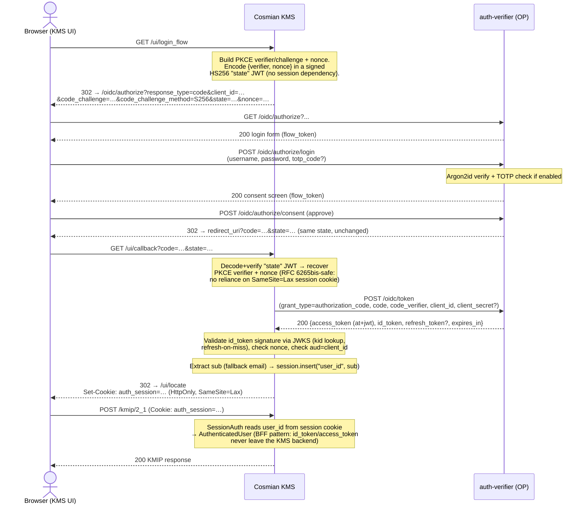
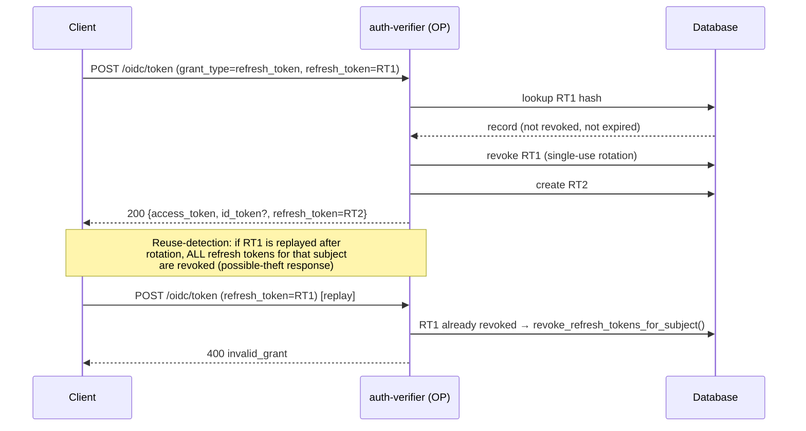

# OpenID Connect provider

The authentication server is a full **OpenID Connect (OIDC) Provider (OP)** in
addition to being a session/credential authentication server. It implements the
Authorization Code flow with mandatory PKCE, refresh tokens, and the
client-credentials grant, and exposes discovery, JWKS, UserInfo, token
introspection and token revocation endpoints.

Implicit and hybrid flows are **not** supported.

## Standards

| RFC / spec | Role |
|------------|------|
| RFC 6749 | OAuth 2.0 Authorization Framework |
| RFC 6750 | Bearer token usage |
| RFC 7636 | PKCE (S256 — mandatory) |
| RFC 8414 | Authorization Server Metadata (discovery) |
| RFC 7662 | Token introspection |
| RFC 7009 | Token revocation |
| RFC 9068 | JWT access tokens (`at+jwt`) |
| RFC 7515/7517/7518/7519 | JOSE / JWK / JWA / JWT |
| OpenID Connect Core / Discovery 1.0 | ID tokens, UserInfo, discovery |

## Security separation

The OP maintains strict internal separation between token types so they can
never be substituted for one another:

- **ID token** — signed JWT, `aud = client_id`, carries `nonce`, `auth_time`
  and `at_hash`.
- **Access token** — signed JWT with an explicit `typ: at+jwt` header
  (RFC 9068) and a distinct audience.
- **Session cookie** (`_ea_`) — opaque session key, unchanged, with its own
  signing key.

ID and access tokens are signed with a **dedicated OIDC signing key** whose
`kid` differs from the session-JWT key. Configure it under `oidc_params`; when
omitted the server falls back to the session/TLS key and logs a warning.

## Endpoints

| Method | Path | Purpose |
|--------|------|---------|
| GET | `/.well-known/openid-configuration` | Discovery metadata |
| GET | `/oidc/jwks` | Combined JWKS (OIDC + session keys) |
| GET | `/oidc/authorize` | Authorization endpoint → login form |
| POST | `/oidc/authorize/login` | Submit credentials → consent screen |
| POST | `/oidc/authorize/consent` | Approve/deny → redirect with code |
| POST | `/oidc/token` | Token endpoint (code / refresh / client_credentials) |
| GET·POST | `/oidc/userinfo` | UserInfo (Bearer access token) |
| POST | `/oidc/introspect` | Token introspection (RFC 7662) |
| POST | `/oidc/revoke` | Token revocation (RFC 7009) |

## Configuration

```toml
[oidc_params]
issuer = "https://auth.example.com"
oidc_signing_private_key = "/etc/auth/oidc_signing.key.pem"
oidc_signing_public_key  = "/etc/auth/oidc_signing.pub.pem"
id_token_ttl_secs = 3600
access_token_ttl_secs = 3600
refresh_token_ttl_secs = 1209600
code_ttl_secs = 60
supported_scopes = ["openid", "profile", "email", "offline_access", "roles"]
# default_audience = "https://api.example.com"
```

All fields are optional. When `[oidc_params]` is absent the OP still runs with
defaults, deriving the issuer from the server host/port and signing with the
session/TLS key.

## Provisioning a client

OAuth clients are registered per realm by a realm admin:

```bash
curl -sk -b cookies.txt -X POST \
  https://localhost:8443/realms/my-realm/clients \
  -H 'Content-Type: application/json' \
  -d '{
        "client_name": "My Web App",
        "redirect_uris": ["https://app.example.com/callback"],
        "grant_types": ["authorization_code", "refresh_token"],
        "response_types": ["code"],
        "scopes": ["openid", "profile", "email", "offline_access"],
        "token_endpoint_auth_method": "client_secret_basic"
      }'
```

The response returns the generated `client_id` and, for confidential clients,
the `client_secret` — shown **only once**. Use
`"token_endpoint_auth_method": "none"` for a public (PKCE-only) client.

## Authorization Code + PKCE flow

1. Redirect the user to
   `GET /oidc/authorize?response_type=code&client_id=…&redirect_uri=…&scope=openid…&state=…&nonce=…&code_challenge=…&code_challenge_method=S256`.
2. The server renders a login form; the user authenticates with their realm
   username/password (and TOTP if enabled), then approves the consent screen.
3. The server redirects back to `redirect_uri?code=…&state=…`.
4. Exchange the code at the token endpoint:

```bash
curl -sk -u "$CLIENT_ID:$CLIENT_SECRET" -X POST \
  https://localhost:8443/oidc/token \
  -d grant_type=authorization_code \
  -d code=$CODE \
  -d redirect_uri=https://app.example.com/callback \
  -d code_verifier=$CODE_VERIFIER
```

The response contains `access_token`, `id_token`, `refresh_token`,
`token_type`, `expires_in` and `scope`. Refresh tokens rotate on every use, and
replaying a rotated (revoked) refresh token invalidates the whole token family.

See the [API reference](api_reference.md) and the OpenAPI schema for the full
endpoint and error catalogue.

## Sequence diagrams — what is currently implemented

The diagrams below show the exact flows implemented today, using the Cosmian
KMS Web UI as the relying-party example (its Backend-For-Frontend pattern:
the browser never sees the `id_token`/`access_token` — only an opaque
KMS session cookie).

### Authorization Code + PKCE (Web UI login → authenticated KMIP call)



### Refresh token rotation



### Client credentials (machine-to-machine)

```mermaid
sequenceDiagram
    participant Service as Service account
    participant AV as auth-verifier (OP)

    Service->>AV: POST /oidc/token<br/>(grant_type=client_credentials, scope=…)<br/>Authorization: Basic client_id:client_secret
    Note over AV: No end-user → no id_token, no refresh_token.<br/>email claim = client_id (service-account identity).
    AV-->>Service: 200 {access_token (at+jwt), expires_in, scope}

    Note over Service: Access token is used as a Bearer-scheme credential<br/>against the KMS's [idp_auth] jwt_auth_provider path<br/>(kid + iss validated; no [auth_verifier] section needed)
```

## Known limitations

The list below documents current, intentional scope boundaries of the OIDC
Provider. It reflects a deliberate design trade-off: auth-verifier targets a
**single-tenant, embedded, air-gapped/data-sovereign deployment** (one
auth-verifier instance per KMS deployment), not a general-purpose,
multi-tenant identity platform. Items are grouped by priority for the
current roadmap; items in the last group are explicitly deferred to a
dedicated future ADR rather than scheduled.

### Security hardening (near-term)

- **No rate limiting on OIDC endpoints.** `/oidc/authorize/login`,
  `/oidc/token`, and `/oidc/introspect` have no brute-force protection today
  — only the legacy `/login` endpoint is rate-limited. Password guessing,
  TOTP guessing, and refresh-token/client-secret guessing on these routes are
  currently unthrottled.
- **No structured audit trail for OIDC events.** Login success/failure,
  token issuance, consent grant/deny, introspection, revocation, and OAuth
  client CRUD are not emitted as structured (SIEM-consumable) audit events —
  only ad-hoc trace/debug logs. The legacy `/login` endpoint already has this
  convention; it has not been extended to `/oidc/*`.
- **No RP-Initiated Logout.** There is no `end_session_endpoint` / `/oidc/logout`
  route. Relying parties must implement their own logout redirect and cannot
  ask the OP to invalidate the server-side session or outstanding refresh
  tokens as part of logout.
- **Access tokens are not individually revocable.** This is standard
  behaviour for stateless JWTs (and is called out explicitly in the
  revocation endpoint's own documentation), but it means a compromised access
  token remains valid for its full lifetime (default 1 hour) with no
  emergency kill-switch.
- **No graceful signing-key rotation.** Changing the configured OIDC signing
  key is a hard cutover: the previous public key is not retained in the JWKS
  for verify-only use, so every outstanding token becomes unverifiable the
  instant the key changes. There is currently no documented safe rotation
  procedure (issue a new key, keep the old one in the JWKS until all
  outstanding tokens naturally expire, then remove it).

### UX polish (low priority)

- **No consent-skip for trusted/first-party clients.** The full consent
  screen is always shown, even for a client that is realistically the only
  relying party in a given deployment.
- **No operator branding.** The login/consent pages show a fixed, generic
  logo/title; there is no configuration option for an operator to display
  their own organisation's name or logo.

### Explicitly deferred — candidates for a future ADR, not scheduled

These are architecturally significant additions (not small patches) that
would only be worth building in response to a concrete deployment
requirement:

- **Upstream enterprise federation** (delegating authentication to an
  existing corporate directory/identity provider rather than storing
  credentials locally). Distinct from consumer-style social login, which
  remains fully out of scope.
- **SCIM-based user lifecycle provisioning.** The existing plain REST API
  already supports scripted bulk user provisioning/deprovisioning; SCIM's
  value is mainly interoperating with off-the-shelf connector tooling, which
  only matters once upstream federation exists.
- **Dynamic (self-service) OAuth client registration.** Clients are
  currently provisioned by a realm admin via the REST API/admin UI, which
  fits the small, predictable client count of a single-tenant deployment.
- **Pushed Authorization Requests / a formal high-assurance security
  profile.** Would only be pursued in response to a specific regulated
  customer's certification requirement.
- **Self-service, email-based password reset.** Requires adding outbound
  email (SMTP) capability, which does not exist today and is in tension with
  fully air-gapped deployments. The current admin-driven `change_password`
  flag is the intended pattern for this deployment model, not a stopgap.

### Explicitly out of scope, not tracked as a gap

- **WebAuthn/FIDO2 for OIDC end-users.** A database column reserving space
  for a FIDO2 credential identifier exists on the internal administrator
  model, but there is no registration or authentication logic anywhere in
  the codebase for any account type. TOTP already covers the second-factor
  security need for the OIDC login flow.
- **Per-tenant OIDC identity (multiple issuers/signing keys per instance).**
  The OIDC issuer, signing key, and JWKS are built once per process and
  shared across all realms. This is intentional given the confirmed
  single-tenant, one-instance-per-deployment operating model; realms isolate
  users/clients/roles, not OIDC identity.
