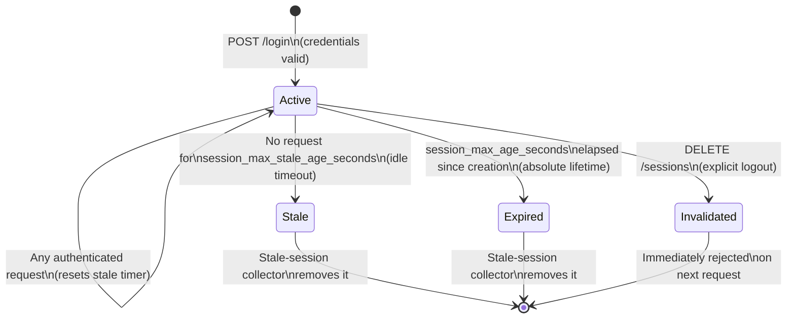

# Session Management

This document covers the session lifecycle, the three strategies for validating sessions in your API server, the session cookie format, session actions (bulk logout), and the stale-session cleanup background task.

---

## Table of Contents

- [Session Management](#session-management)
  - [Table of Contents](#table-of-contents)
  - [The Session Cookie](#the-session-cookie)
  - [Session Lifecycle](#session-lifecycle)
  - [Session Validation Strategies](#session-validation-strategies)
    - [Strategy 1 — Auth Server Session Endpoint (recommended)](#strategy-1--auth-verifier-session-endpoint-recommended)
    - [Strategy 2 — Direct Session Store Query](#strategy-2--direct-session-store-query)
    - [Strategy 3 — Offline JWT Validation](#strategy-3--offline-jwt-validation)
  - [Session Actions — Bulk Logout](#session-actions--bulk-logout)
    - [Log out everywhere else (keep current session)](#log-out-everywhere-else-keep-current-session)
    - [Log out from every device](#log-out-from-every-device)
    - [Cross-scheme bulk logout](#cross-scheme-bulk-logout)
  - [Stale Session Cleanup](#stale-session-cleanup)
  - [Session Parameters (per realm)](#session-parameters-per-realm)

---

## The Session Cookie

On successful authentication, the server sets an `_ea_` cookie:

```text
Set-Cookie: _ea_=<cookie_string>; HttpOnly; Secure; SameSite=Strict
```

The `cookie_string` is an **opaque token** — a lookup key into the server-side session store. It is not a JWT and contains no embedded session data. All session state is stored server-side.

The server also returns a `session_id` (UUID) in the JSON response body:

```json
{
  "next_step": "Authenticated",
  "session_id": "550e8400-e29b-41d4-a716-446655440000"
}
```

The `session_id` can be used to look up or invalidate the session via the API. The `cookie_string` (from the cookie) or the `session_id` (from the response body) can both be used to retrieve `SessionData`.

---

## Session Lifecycle



Sessions are validated on every request. A session is considered expired when:

1. `created_at + max_age_seconds < now` (absolute lifetime exceeded), OR
2. `last_access + max_stale_age_seconds < now` (idle timeout exceeded).

The stale-session collector (a background task) periodically purges expired sessions from the store. With Redis, sessions are purged automatically via TTL.

---

## Session Validation Strategies

Your API server can validate incoming sessions using three strategies. Choose based on your deployment's security requirements and performance constraints.

```text
Client ──► Your API ──► Validate Session ──► Auth Server
```

### Strategy 1 — Auth Verifier Session Endpoint (recommended)

Call `GET /sessions/{session_id}` on the auth-verifier for every request. This is the most secure strategy: session revocations take effect immediately.

**Pros:** Immediate invalidation. No local state. Simple implementation.
**Cons:** One additional HTTPS round-trip per request.

```rust
use auth_client::{AuthClient, AuthClientScheme};

let auth = AuthClient::new("https://auth.example.com", &ca_pem, AuthClientScheme::None)?;

// Extract session_id from the _ea_ cookie value
let session_id = req.cookie("_ea_").map(|c| c.value().to_string());

let session = auth.get_session(&session_id).await?;

match session {
    None => return Err(HttpError::Unauthorized),
    Some(s) => {
        // s.username, s.realm_id, s.auth_scheme are guaranteed valid
    }
}
```

**Latency mitigation:** Run the auth-verifier on the same private network as your API server (or on the same host). A Redis session store further reduces lookup latency to sub-millisecond.

---

### Strategy 2 — Direct Session Store Query

Bypass the auth-verifier HTTP API and query the session store directly. Requires your API server to have access to the session store database (PostgreSQL, Redis, etc.).

This strategy reduces latency but requires shared database access and couples the API server to the session store schema.

**Pros:** Lower latency (no auth-verifier round-trip). Immediate invalidation still possible.
**Cons:** Requires database access from the API server. Schema coupling.

---

### Strategy 3 — Offline JWT Validation

The `_ea_` cookie value is a plain-text `cookie_string`; it is not a JWT. However, the `GET /whoami?realm={realm}` endpoint returns a signed JWT containing the session claims. Your API server can cache this JWT and validate it offline for a short window.

> **Warning:** This approach delays session revocation visibility by the JWT's caching window. Use only when latency requirements preclude round-trips to the auth-verifier and you accept the security trade-off.

In practice, for most deployments Strategy 1 with a Redis session store provides sufficient performance.

---

## Session Actions — Bulk Logout

When validating a session, you can simultaneously revoke other sessions for the same user. This is the recommended implementation for "log out everywhere else" and "log out from every device" features.

### Log out everywhere else (keep current session)

```rust
use auth_client::{
    AuthClient, AuthClientScheme, AuthenticatedClientScheme, AuthScheme, SessionsAction,
};

let session = auth.get_session_with_action(
    &current_session_id,
    vec![
        AuthenticatedClientScheme {
            username: "alice".to_string(),
            auth_scheme: AuthScheme::UsernamePassword,
        },
    ],
    SessionsAction::LogoutOtherSessions,
).await?;
// All of alice's other sessions are now revoked.
// The current session remains active and its SessionData is returned.
```

### Log out from every device

```rust
let session = auth.get_session_with_action(
    &current_session_id,
    vec![
        AuthenticatedClientScheme {
            username: "alice".to_string(),
            auth_scheme: AuthScheme::UsernamePassword,
        },
    ],
    SessionsAction::LogoutAllSessions,
).await?;
// ALL sessions for alice (including the current one) are revoked.
// SessionData is returned before deletion.
```

### Cross-scheme bulk logout

If a user can authenticate through multiple schemes (e.g., username/password for a web app and JWT for the CLI), you can revoke sessions across all schemes:

```rust
let session_ids = auth.get_sessions_for_clients(
    "my-service",
    &[
        AuthenticatedClientScheme { username: "alice".to_string(), auth_scheme: AuthScheme::UsernamePassword },
        AuthenticatedClientScheme { username: "alice".to_string(), auth_scheme: AuthScheme::Jwt },
        AuthenticatedClientScheme { username: "alice".to_string(), auth_scheme: AuthScheme::ClientCertificate },
    ],
).await?;

auth.delete_sessions(&session_ids).await?;
```

---

## Stale Session Cleanup

For SQL-backed session stores, a background task periodically purges sessions that have exceeded their `max_age_seconds` or `max_stale_age_seconds`.

Configure the cleanup interval in `auth_verifier.toml`:

```toml
[stale_session_collector_config]
# Cleanup interval in seconds. Default: 60.
cleanup_interval_seconds = 300
```

For **Redis**-backed session stores, cleanup is automatic via TTL — the collector is not needed.

You can also trigger an immediate purge of all expired sessions:

```rust
auth.delete_expired_sessions().await?;
```

---

## Session Parameters (per realm)

Session lifetime is configured per realm and managed via the `Realm` API at runtime.

| Parameter | Type | Description |
|-----------|------|-------------|
| `session_max_age_seconds` | `i64` | Maximum absolute session lifetime. The session expires this many seconds after creation regardless of activity. |
| `session_max_stale_age_seconds` | `i64` | Idle timeout. The session expires if no request has been made for this many seconds. Any authenticated request resets this timer. |

Example — short-lived sessions with a 30-minute idle timeout:

```json
{
  "id": "my-service",
  "auth_params": { ... },
  "session_max_age_seconds": 86400,
  "session_max_stale_age_seconds": 1800
}
```

Example — long-lived sessions for a CLI tool:

```json
{
  "id": "cli",
  "auth_params": { ... },
  "session_max_age_seconds": 2592000,
  "session_max_stale_age_seconds": 604800
}
```
