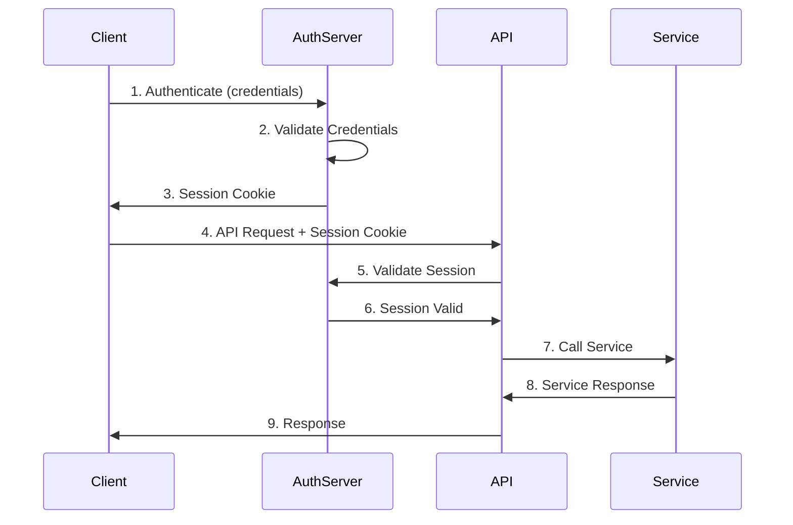
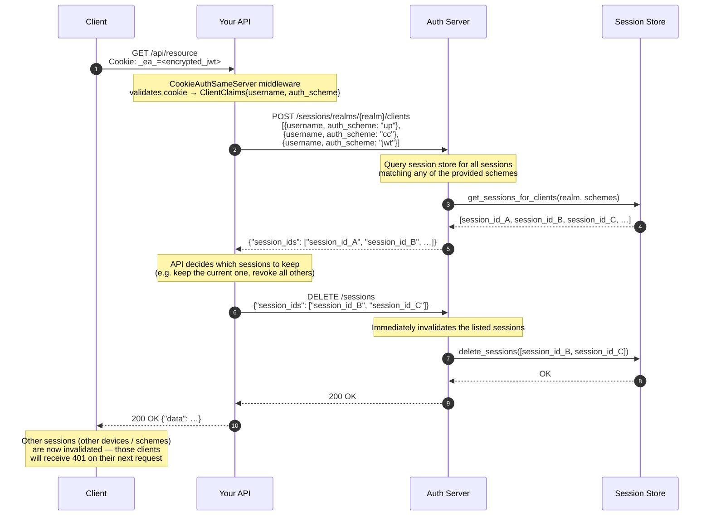

# Authentication Server Documentation

The authentication server handles many authentication methods while providing a simple and consistent interface for API servers to validate client sessions.

## Introduction

The authentication server's **primary role** is to provide login mechanisms that issue a session cookie, which external Auth API servers then use to validate each incoming request.

The server manages client authentication in isolated realms. The following authentication methods are **currently implemented**:

- Username and password (HTTP Basic Auth, Argon2id-hashed passwords)
- OAuth2, OpenID Connect: JWT bearer token (RS256 / ES256, JWKS-based)
- Client certificate (mTLS, EC P-256)
- Two-factor authentication using TOTP (RFC 6238)

The following methods are **planned for future implementation**:

- Enterprise SSO using SAML
- Authentication using OpenID4 Verifiable Proofs (Decentralized Identity)
- Passwordless authentication (WebAuthn, Hardware Tokens)
- Two-factor authentication using WebAuthn, Hardware Tokens, or OOB (SMS/Email)

Once a client is authenticated, the server issues a session cookie which is returned to the client. This cookie is then used by the client to authenticate subsequent requests to an API server.
The API server validates the session cookie with the authentication server to ensure the client is authenticated.

> **Note on Users vs Clients:** `Admin` records (super admins and realm admins) are simply authenticated clients that also hold a `Admin` record granting them server-administration privileges. Every admin must still log in through the normal `/login` endpoint — there is no separate admin login path. A `Admin` record has no special meaning outside the auth server's own administration APIs.

## Authentication Flow

**Flow Description:**

1. Client authenticates with one of the supported methods (username/password, JWT bearer, or client certificate)
2. Authentication server validates the provided credentials
3. Upon successful validation, session cookie is issued to the client
4. Client makes API request, including the session cookie
5. API server validates the session with authentication server
6. Authentication server confirms session is valid
7. API server calls the requested service
8. Service returns response to API server
9. API server returns final response to client

## Cross-Scheme Session Lookup and Forced Logout

Once a session has been validated on the Auth Server, the API can use that session to query all active sessions belonging to the same client identity — regardless of which authentication scheme was used to create them. This enables scenarios such as enforcing a single active session, detecting concurrent logins from unexpected locations, or explicitly logging a client out from all other devices and methods.

The `POST /sessions/realms/{realm}/clients` endpoint accepts a list of `AuthenticatedClientScheme` entries — each combining a `username` with one of the supported authentication schemes (`up`, `jwt`, `cc`, `f2`, `dc`). It returns the matching session IDs across all those schemes. The API can then call `DELETE /sessions` with any subset of those IDs to selectively revoke them.

> **Typical use cases:**
>
> - **Single active session enforcement** — after a successful login, revoke all other sessions for the same user to prevent concurrent access.
> - **Security event response** — if anomalous activity is detected, revoke all sessions for a user across every authentication scheme in one call.
> - **Account takeover mitigation** — when a password or certificate change is detected, force re-authentication everywhere by revoking all existing sessions.

## Application Programming Interfaces (APIs)

The authentication server exposes a RESTful API.

The API is separated into 3 sections:

- the realm management API, open to super admins,
- the admin management API, open to realm admins,
- and the authentication API, open to all clients.

Administrator clients authenticate against the special `_` realm. The API endpoint to authenticate is `/login?realm={realm}`.

---

## Terminology

| Term | Definition |
|------|------------|
| **Client** | Any entity that authenticates against `/login` and receives a session cookie: a human via browser, the Auth CLI, a machine/service account, etc. Represented in the code as `AuthenticatedClient` / `ClientClaims`. |
| **Admin** | An `Admin` database record representing an administrator account. Every `Admin` has a `realms` list that determines what it may administer. An `Admin` is always either a super admin or a realm admin — there are no non-admin `Admin` records. |
| **Super Admin** | An `Admin` whose `realms` list contains `"_"` (the `ADMIN_REALM`). Can administer every realm and every other `Admin` record. |
| **Realm Admin** | An `Admin` whose `realms` list contains one or more specific realm IDs (but not `"_"`). Can only administer the explicitly listed realms and the `Admin` records that belong exclusively to those realms. |
| **UserPass** | A credential record in the `userpass` table that stores an Argon2id-hashed password for a given username and realm. Referenced by `Admin.userpass` (a foreign key by username). |
| **Realm** | An isolated authentication domain with its own encryption key, session settings, and allowed authentication methods. The `_` realm is the administrative realm. |
| **Session** | A server-side record created on successful login, identified by a `session_id` and encrypted into the `_ea_` cookie. Scoped to the realm the client logged into. |

---

## Documentation Index

| Document | Description |
|----------|-------------|
| [Getting Started](getting_started.md) | Installation, first-run bootstrap, creating your first realm and user, verifying the setup. |
| [Server Configuration](server_configuration.md) | Complete reference for the `auth_verifier.toml` configuration file: TLS, database backends, session store, proxy, stale-session cleanup, and JWT signing keys. |
| [Authentication Flows](authentication_flows.md) | Detailed sequence diagrams for every authentication method: username/password, JWT bearer, mTLS client certificates, and TOTP. Includes session lifecycle, endpoint reference, and a request-authentication decision flowchart. |
| [API Reference](api_reference.md) | Full HTTP endpoint reference: every route, request/response body schemas, status codes, and authentication requirements. |
| [Client Library](client_library.md) | How to use the `auth_client` crate in an API server: session validation, realm management, admin and credential management, TOTP management. |
| [Session Management](session_management.md) | Session lifecycle, validation strategies (cookie decryption, session endpoint, direct store query), session actions, stale-session cleanup. |
| [Two-Factor Authentication](two_factor_authentication.md) | TOTP implementation: module architecture, data model, enrollment flow (`POST /realms/{realm}/totp/generate` + `POST /realms/{realm}/totp/verify`), login-flow integration (`TotpRequired` step), disable endpoint (`DELETE /realms/{realm}/totp/{username}`), per-realm configuration (algorithm and time step), code path walkthrough, and security considerations. |
| [Authorization and Administration](authorization_and_administration.md) | The two-tier super admin / realm admin model, the exclusive-ownership rule, endpoint authorization matrix, how to bootstrap the first admin, how to create realm admins, and known caveats. |
