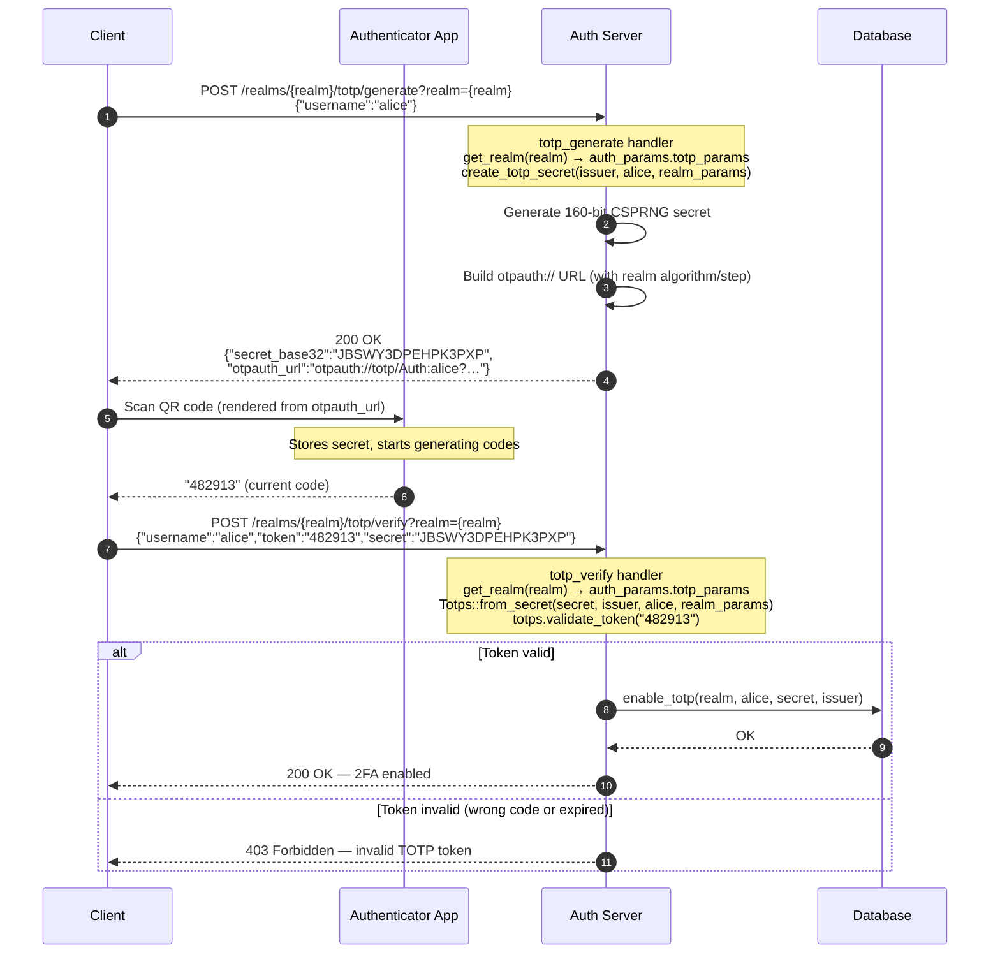
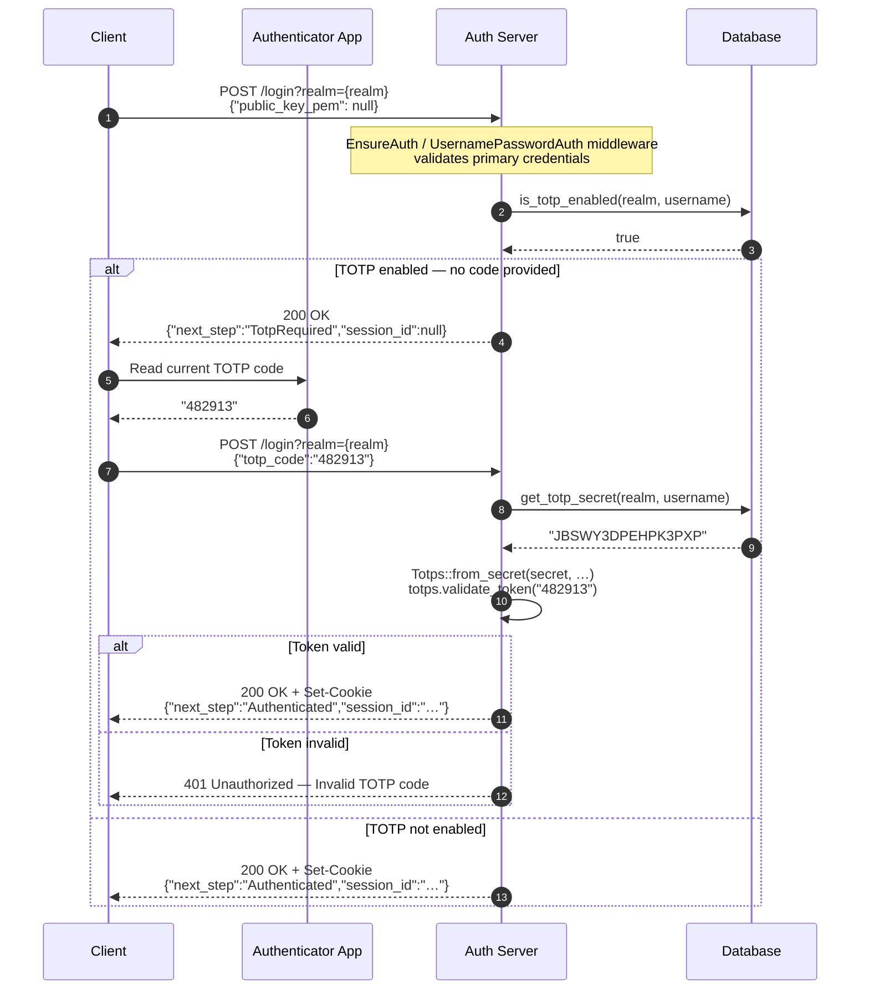
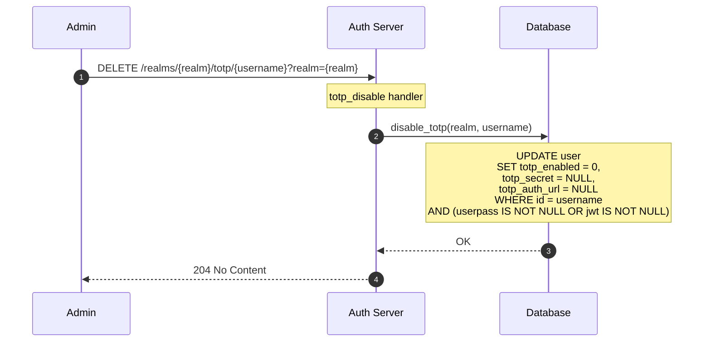

# Two-Factor Authentication (TOTP)

This document explains how Time-based One-Time Passwords (TOTP) are used as a second authentication factor, how to enroll a client account for 2FA, how the login flow changes when 2FA is active, and how to disable 2FA.

> **Terminology:** A **client** is the entity that authenticates against `/login` (a human, a service, the CLI). A **User** record is the administrator account stored in the database — TOTP state (`totp_enabled`, `totp_secret`) is stored on the `User` record, but it is the **client** that presents TOTP codes at login time. See [index.md](index.md#terminology) for the full glossary.

---

## What is TOTP?

TOTP (RFC 6238) generates a 6-digit code that changes every 30 seconds. The user's authenticator app (Google Authenticator, Authy, 1Password, Apple Passwords, etc.) and the server share a secret. Both independently compute the current code using the same algorithm — there is no network communication between the app and the server to verify. If the codes match, the user has proven they possess the shared secret.

```
shared_secret + current_time_window ──► HMAC-{algorithm} ──► 6-digit code
                                        (default: SHA1; configurable per realm)
```

| Parameter | Default | Notes |
|-----------|---------|-------|
| Algorithm | HMAC-SHA1 | Configurable per realm: SHA1, SHA256, SHA512 |
| Code length | 6 digits | Fixed |
| Time step | 30 seconds | Configurable per realm |
| Tolerance (skew) | ±1 step (accepts previous, current, next window) | Fixed |
| Secret size | 160 bits (CSPRNG) | Fixed |

---

## Architecture

### Module structure

| Module | Source path | Responsibility |
|--------|-------------|----------------|
| `totp` | `src/totp/mod.rs` | Core TOTP primitives: secret generation, token validation, `otpauth://` URL construction |
| `middleware::totp` | `src/middleware/totp.rs` | `TotpMiddleware` — orchestrates enrollment (with realm-config lookup), verify-and-enable, disable, status check |
| `database::trait` | `src/database/trait.rs` | `Database` trait with TOTP persistence method signatures |
| `database::impls` | `src/database/impls/{sqlite,postgres,mysql}.rs` | TOTP persistence: secret storage, enabled flag, `otpauth://` URL |
| `models::base` | `src/models/base.rs` | `User` struct carrying the TOTP fields |

### Data model

TOTP state is stored on the `User` record:

```rust
pub struct User {
    pub totp_enabled:   Option<bool>,    // Is 2FA currently active?
    pub totp_secret:    Option<String>,  // Base32-encoded shared secret
    pub totp_auth_url:  Option<String>,  // otpauth:// URL stored at enable time
    // …
}
```

### `TotpMiddleware` and `Database` persistence methods

`TotpMiddleware` is a programmatic service component. Its methods are called by other server code (e.g., by the TOTP HTTP endpoints). The HTTP endpoints are registered under the `/realms` scope.

The `Database` trait provides the following TOTP persistence methods:

| Method | Description |
|--------|-------------|
| `generate_totp_secret(realm, username)` | Generates a random TOTP secret using **default params** (`Totps::new()`); returns only the Base32 string. Does not use realm TOTP config; does not persist anything. Lower-level helper — prefer `TotpMiddleware::handle_totp_generate` for enrollment. |
| `enable_totp(realm, username, secret, issuer)` | Stores the verified secret, sets `totp_enabled = 1`, regenerates and stores `totp_auth_url` (using default SHA1/30 s params — see per-realm note). Targets `WHERE id = username AND (userpass IS NOT NULL OR jwt IS NOT NULL)`. |
| `disable_totp(realm, username)` | Clears secret and auth URL, sets `totp_enabled = 0`. Same `WHERE` condition as `enable_totp`. |
| `get_totp_secret(realm, username)` | Returns the stored Base32 secret, or `None` if not set. |
| `is_totp_enabled(realm, username)` | Returns `Some(true/false)` for the user's TOTP state, or `None` if the user is not found. |

---

## Enrollment Flow

Before a client can use 2FA their account must be **enrolled**: generate a secret, scan it into their authenticator app, and verify one code to confirm they can produce valid tokens.

The enrollment flow is exposed via two HTTP endpoints under the `/realms` scope:

| Endpoint | Description |
|----------|-------------|
| `POST /realms/{realm}/totp/generate?realm={realm}` | Generate a new TOTP secret for a user. Returns `secret_base32` and `otpauth_url`. The secret is **not** stored yet. |
| `POST /realms/{realm}/totp/verify?realm={realm}` | Validate a one-time code against the generated secret. On success, the secret is stored and TOTP is activated for the user. |

Both endpoints require a valid session cookie from a realm administrator.



### `otpauth://` URL format

The URL encodes everything the authenticator app needs:

```
otpauth://totp/{issuer}:{username}?secret={base32}&issuer={issuer}&algorithm={algorithm}&digits=6&period={step}
```

The `algorithm` and `period` values come from the realm's TOTP configuration (`auth_params.totp_params`). Example for a realm using the defaults (SHA1, 30-second step):

```
otpauth://totp/Auth:alice?secret=JBSWY3DPEHPK3PXP&issuer=Auth&algorithm=SHA1&digits=6&period=30
```

Render this as a QR code and display it to the client **exactly once** during enrollment. After enrollment, the raw secret must never be shown again.

---

## Login Flow with TOTP

When TOTP is enabled for a user, the `POST /login` endpoint enforces a two-step login:

1. The client sends credentials as usual. If they are valid **and** TOTP is enabled, the server returns `TotpRequired` instead of issuing a session cookie.
2. The client sends the same credentials again, this time including a `totp_code`. The server validates the code and, if correct, issues the session cookie.

If TOTP is **not** enabled for the user, step 1 returns `Authenticated` directly (no change from the regular flow).

### Authentication Sequence



### `LoginRequest` and `AuthenticationNextStep`

```rust
pub struct LoginRequest {
    pub public_key_pem: Option<String>,
    pub totp_code: Option<String>,       // Omit on first attempt; send on second
}

pub enum AuthenticationNextStep {
    ChangePassword,
    TotpRequired,                        // Credentials valid, TOTP code still needed
    Authenticated,
}
```

---

## Disabling 2FA

An administrator can disable TOTP on a client's account via:

```
DELETE /realms/{realm}/totp/{username}?realm={realm}
```

This clears the stored secret and `totp_enabled` flag on the `User` record. Requires a valid session cookie from a realm administrator.



After this, the client logs in via primary credentials only, with no TOTP code required.

---

## Code Path Reference

```
── TOTP enrollment ──

POST /realms/{realm}/totp/generate?realm={realm}
  → totp_generate handler (src/server/endpoints/totp_endpoints.rs)
      └── database.get_realm(realm) → auth_params.totp_params (or defaults)
      └── totp::create_totp_secret(issuer, username, totp_params)
          ├── Secret::generate_secret()       // 160-bit CSPRNG
          ├── TOTP::new(algorithm, 6, 1, step, secret_bytes, issuer, username)
          └── Returns (Totps { totp }, secret_base32)
      └── 200 OK: { secret_base32, otpauth_url }  (secret NOT yet stored)

POST /realms/{realm}/totp/verify?realm={realm}
  → totp_verify handler
      └── database.get_realm(realm) → auth_params.totp_params (or defaults)
      └── Totps::from_secret(secret_base32, issuer, username, totp_params)
      └── totps.validate_token(token)
          └── TOTP::check_current(token)      // ±1 step tolerance
      └── (on success) database.enable_totp(realm, username, secret_base32, issuer)
          └── UPDATE user SET totp_enabled=1, totp_secret=?, totp_auth_url=?
              WHERE id=? AND (userpass IS NOT NULL OR jwt IS NOT NULL)
      └── 200 OK: {"status":"ok"}

── TOTP disable ──

DELETE /realms/{realm}/totp/{username}?realm={realm}
  → totp_disable handler
      └── database.disable_totp(realm, username)
          └── UPDATE user SET totp_enabled=0, totp_secret=NULL, totp_auth_url=NULL
              WHERE id=? AND (userpass IS NOT NULL OR jwt IS NOT NULL)
      └── 204 No Content

── Login flow with TOTP ──

POST /login?realm={realm}
  → EnsureAuth / UsernamePasswordAuth middleware
      └── Validates credentials → sets AuthenticatedClient in request extensions
  → login() handler (src/server/endpoints/client_endpoints.rs)
      └── database.is_totp_enabled(realm, username)
          if not enabled:
              └── issue_token + build_cookie + upsert_session
              └── 200 OK + Set-Cookie: { "next_step": "Authenticated", "session_id": "…" }
          if enabled and no totp_code in request:
              └── 200 OK: { "next_step": "TotpRequired", "session_id": null }
          if enabled and totp_code present:
              └── database.get_totp_secret(realm, username) → stored secret
              └── Totps::from_secret(secret, None, username, realm_totp_params)
              └── totps.validate_token(totp_code)
                  if valid:
                      └── issue_token + build_cookie + upsert_session
                      └── 200 OK + Set-Cookie: { "next_step": "Authenticated", "session_id": "…" }
                  if invalid:
                      └── 401 Unauthorized
```

---

## Per-Realm TOTP Configuration

The HMAC algorithm and time step are configurable per realm. They are stored in the realm's `auth_params` JSON column under the `totp_params` key. Realms that do not set `totp_params` use the defaults.

| `auth_params.totp_params` field | Type | Default | Accepted values |
|----------------------------------|------|---------|----------------|
| `algorithm` | string | `"SHA1"` | `"SHA1"`, `"SHA256"`, `"SHA512"` |
| `step` | integer (seconds) | `30` | any positive integer |

### Example realm `auth_params` JSON with custom TOTP config

```json
{
  "jwt_params": { … },
  "username_password_params": { … },
  "totp_params": {
    "algorithm": "SHA256",
    "step": 60
  }
}
```

When a realm sets custom TOTP params:

- `POST /realms/{realm}/totp/generate` uses those params to build the `otpauth://` URL — the authenticator app will therefore use the correct algorithm and period.
- `POST /realms/{realm}/totp/verify` looks up the same params to reconstruct the `Totps` verifier, so the token is checked with the same algorithm and time window.
- The stored `totp_auth_url` in the `User` record is regenerated by `enable_totp` using **default params** (SHA1, 30 s) regardless of the realm's TOTP config — this is a known limitation of the current `enable_totp` implementation. The canonical, authoritative URL (reflecting the realm's actual algorithm and step) is the one returned by `TotpMiddleware::handle_totp_generate` at enrollment time. Callers should use that returned URL for QR-code generation, not `User.totp_auth_url`.

> **Important:** If you change a realm's TOTP params after users have already enrolled, their authenticator apps will continue using the old algorithm/period. All affected users must re-enroll.

---

## Security Considerations

### Protect the secret during enrollment

The `otpauth://` URL and the raw Base32 secret must:

- Only be transmitted over HTTPS
- Be displayed to the client **exactly once** (during enrollment QR-code display)
- Never appear in server logs — TOTP-related log lines use `trace!`/`debug!` macros and are filtered out of production output

### Secret storage

TOTP secrets are stored as plain Base32 strings in the database. In high-security deployments, consider encrypting the `totp_secret` column at rest using a KMS-managed key.

### Brute-force protection

A 6-digit TOTP code has 1 000 000 possible values. With a 30-second window and ±1 skew tolerance (3 valid windows), the effective attack window is short but non-zero. **Rate-limit the login endpoint** to prevent automated guessing. Common threshold: 5 failed attempts per 5-minute window per username.

### Clock synchronisation

TOTP is time-based. The skew of ±1 (accepting the previous/current/next 30-second window) tolerates up to 60 seconds of clock drift between the server and the user's device. Ensure the server clock is synchronised via NTP.

### TOTP fallback / recovery codes

The current implementation does not generate single-use recovery codes. In a production deployment, generate and store a set of hashed recovery codes at enrollment time so users can regain access if they lose their authenticator device.

---

## Example: Enrolling a User via the Rust Client

```rust
use auth_authentication::{AuthClient, AuthClientScheme};

// 1. Authenticate as an administrator
let admin = AuthClient::new("https://auth.example.com", AuthClientScheme::UsernamePassword {
    username: "admin".to_string(),
    password: "admin_password".to_string(),
})?;
admin.login("_", None, None).await?;

// 2. Generate a TOTP secret for the target user
let resp = admin.generate_totp("_", "alice", None).await?;
// resp.secret_base32: Base32 secret
// resp.otpauth_url:   otpauth:// URL — render this as a QR code for alice

// 3. Alice scans the QR code and provides a code from her authenticator
let token = "482913";
admin.verify_and_enable_totp("_", "alice", &resp.secret_base32, token, None).await?;
// TOTP is now enabled for alice.

// 4. To disable TOTP later:
admin.disable_totp("_", "alice").await?;
```
