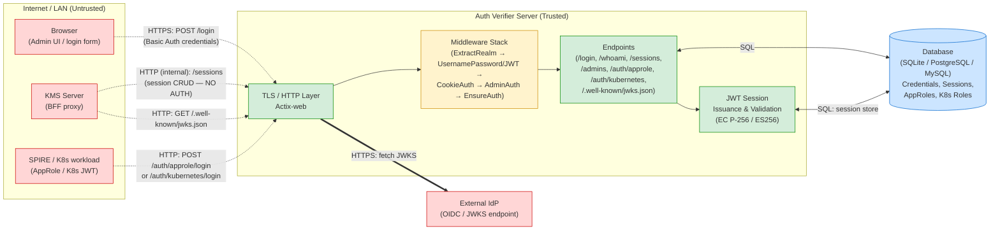
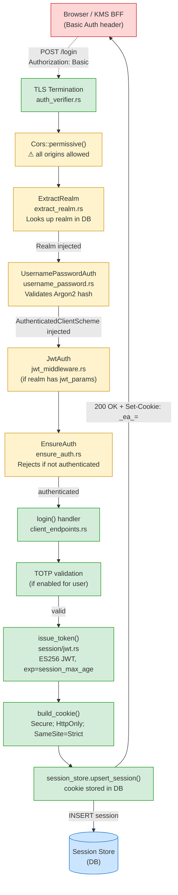
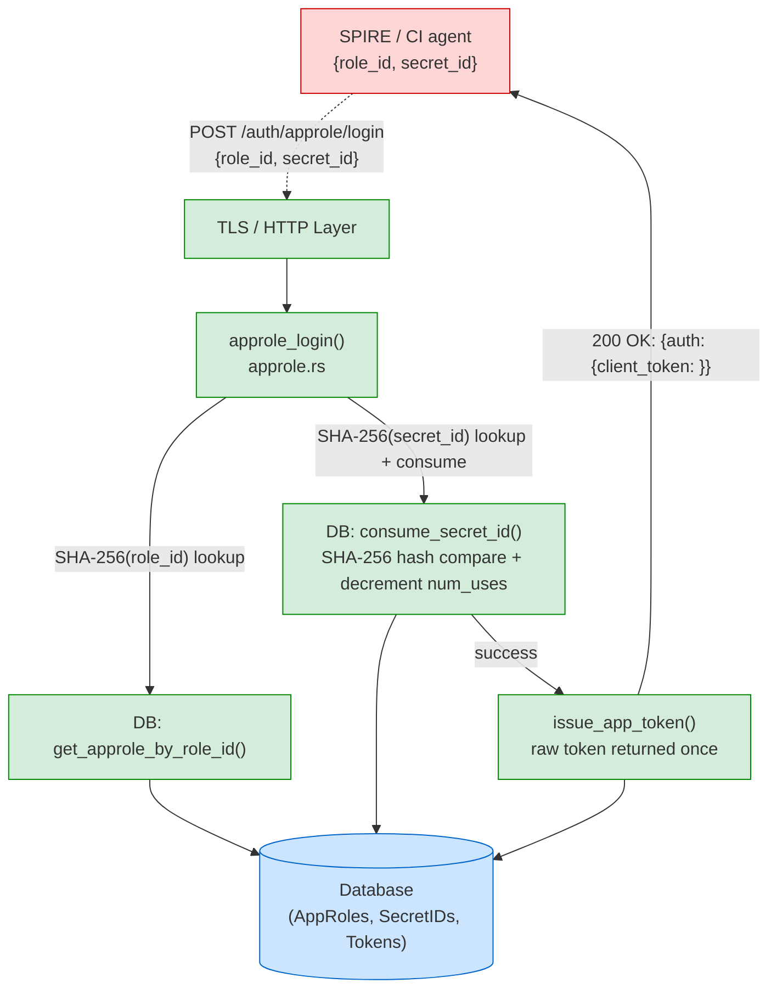
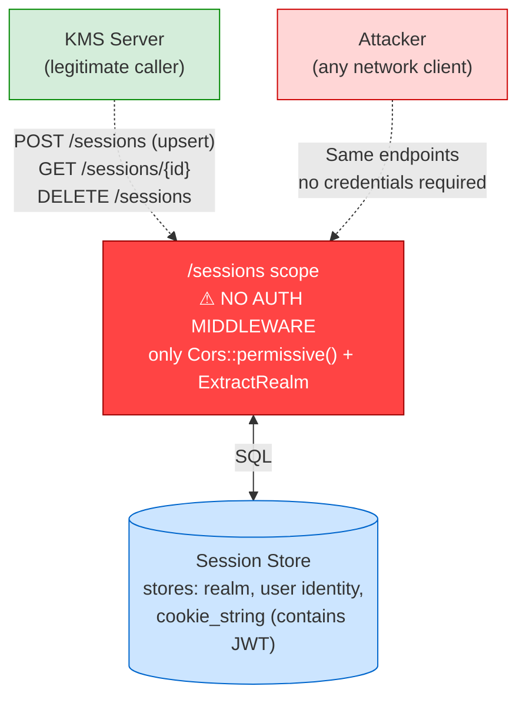

# Data Flow Diagram — Cosmian Authentication Verifier

## Level 0 — System Context

## Level 1 — User Login Flow (POST /login)

## Level 2 — AppRole Login Flow (POST /auth/approle/login)

## Level 3 — Sessions API (unauthenticated — ⚠ CRITICAL trust boundary gap)

## Notes

- The `/sessions` scope (Level 3) has **no authentication middleware** — this is the most critical architectural gap in the current system. It is assumed to be an internal-only API, but there is no network-level or application-level enforcement.
- `Cors::permissive()` is applied on every scope including admin endpoints. The TODO comment at `auth_verifier.rs:324` acknowledges this is not yet tightened.
- In dev mode (no TLS), `Secure` cookies are set but browsers will not send them back over plain HTTP, making the `reqwest`-based test work (it ignores the `Secure` flag) while real browsers would not.
- The JWKS endpoint (`/.well-known/jwks.json`) is unauthenticated and public by design (OIDC standard). It has a 1-hour `Cache-Control` header.
